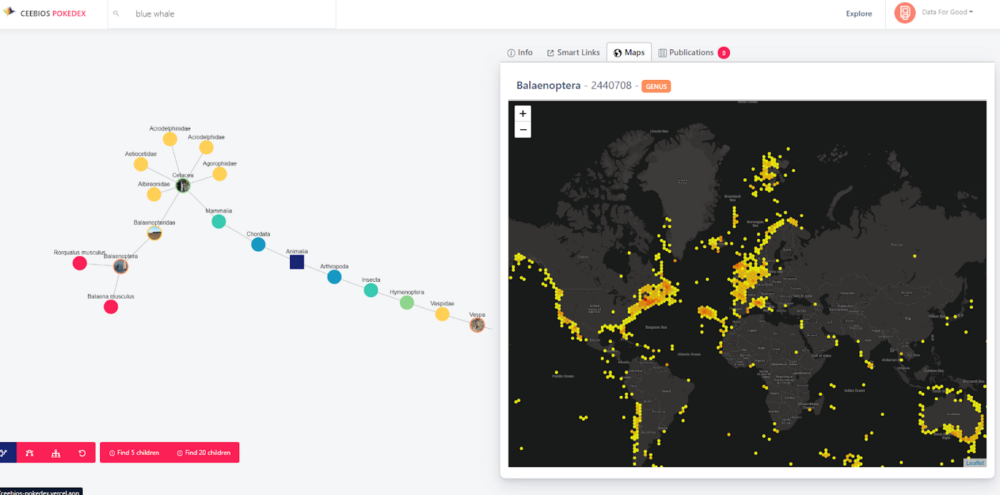
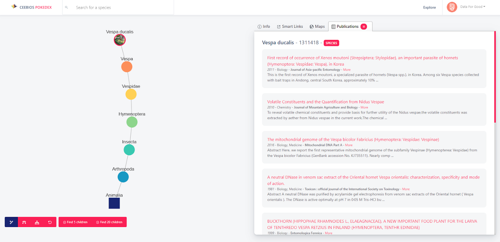

## Le vivant et le biomimétisme

Le biomimétisme consiste à s'inspirer de la nature, ses créatures fantastiques et leurs capacités extraordinaires pour imaginer de nouvelles approches d'ingénierie pérennes, naturelles et plus respectueuses de l'environnement. C'est considérer les stratégies d'adaptation et d'interaction du vivant à son environnement comme une mine d'informations et de connaissances éprouvées par 3,8 milliards d'années d'évolution.

Ceebios est le centre d'études et d'expertises dédié au déploiement du biomimétisme en France. Aux côtés de partenaires conquis par cette technique d'innovation responsable il y a également des industriels comme L'Oréal, Airbus, Engie, et des acteurs du territoire comme la Ville de Senlis. Cette association a pour mission d'accélérer « la transition sociétale par le biomimétisme en fédérant un réseau d'acteurs experts, et en développant les ressources indispensables à l'appropriation de la démarche par les secteurs académiques, institutionnels et privés ».

Et c'est leur projet qui a été choisi par le jury pour obtenir la 2ème place lors du dernier démo-day Data For Good !

## Le projet de la saison 8

Lors de cette 8ème saison, nos 6 super bénévoles — accompagnés par les ingénieurs Ceebios, et les membres de l'équipe GBIF au Muséum National d'Histoire Naturelle,- ont créé un **outil de recherche intelligent sur les bases de données biologiques pour faciliter la connexion entre des ingénieurs et des biologistes, et permettre à un public non-expert d'obtenir sans effort de l'information sur les espèces, leur apparence, leur place dans la classification du Vivant et dans l'écosystème.**

L'enjeu est de taille : Le monde de la recherche biologique et du biomimétisme regorge d'informations, de talents, mais manque souvent d'outils informatiques pertinents et accessibles pour faciliter la recherche et la compréhension de cet univers. C'est sur ce constat que le projet de Ceebios s'est concentré pour créer un “pokedex” de la biodiversité et du biomimétisme : Un outil efficace, aux coloris doux, qui permet de visualiser en un instant la répartition géographique d'une population d'oiseaux, ou encore de pointer vers les publications scientifiques qui décrivent une espèce exotique de limaces. Une avancée de taille pour Ceebios qui fait ainsi son premier pas vers le monde de la data et de l'informatique.

L'un des défis de demain réside peut-être dans un meilleur accès à la littérature scientifique, aujourd'hui hautement protégée par la propriété intellectuelle, ainsi que l'intégration de stratégies de science collaborative pour valider et orienter les réponses de la plateforme grâce aux retours des utilisateurs. Un sujet sur lequel Ceebios et les équipes du Museum n'ont pas fini de travailler…

## L'outil pokédex

Alors, que peut-on faire avec cet outil ?
- Chercher des espèces plantes ou animales en latin (Balaena musculus) ou avec leur nom vernaculaire (Baleine Bleue)
- Visualiser la hiérarchie des espèces avec un réseau de graphe pour naviguer et remonter l'arbre des espèces
- Récupérer les photos des dernières occurrences de ces espèces
- Récupérer et centraliser la description Wikipedia
- Visualiser les occurrences spatiales de ces espèces sur la planète
- Relier les espèces à des publications scientifiques sur la même plateforme. 190 millions d'articles ont été analysés et indexés aux 5 millions d'espèces.

<figcaption align = "center"><i>Visualiser les photos et récupérer la description wikipedia</i></figcaption>
 

<figcaption align = "center"><i>Visualiser les occurrences spatiales de ces espèces sur la planète</i></figcaption>
 

<figcaption align = "center"><i>Relier les espèces à des publications scientifiques sur la même plateforme. 190 millions d'articles ont été analysés et indexés aux 5 millions d'espèces.</i></figcaption>
 

Vous pouvez revoir la démonstration de l'outil avec cette vidéo présentée au démo day : 

<iframe width="100%" height="500px" src="https://www.youtube.com/embed/JdSGClNM6g0" title="YouTube video player" frameborder="0" allow="accelerometer; autoplay; clipboard-write; encrypted-media; gyroscope; picture-in-picture" allowfullscreen></iframe>

> « Les data scientists de notre équipe se sont emparés d'un problème mal posé, d'une idée balbutiante, et en ont fait un outil que je trouve élégant par sa simplicité, son caractère esthétique, autant que pour l'accès impressionnant qu'il donne à une donnée biologique polymorphe et touffue ! »
> *Adrien Saint-Sardos, Ceebios*

> « Se plonger dans la richesse de la biodiversité est une expérience d'humilité. Etudier les données qui la concerne permet à la fois de se rendre compte de sa complexité et des dangers qui la menacent.»
> *Théo Alves Da Costa, Data For Good*

## Références
- Parce que c'est un projet Data For Good, Gawdi est bien sûr open source, ici le GitHub : https://github.com/dataforgoodfr/batch8_ceebios
- Toutes les informations sur les [collaborations entre Data For Good et Ceebios](/projects/ceebios)

##### A propos de Ceebios
Ceebios accélère la transition sociétale par le biomimétisme en fédérant un réseau d'acteurs experts et en développant les ressources indispensables à l'appropriation de la démarche par les secteurs académiques, institutionnels et privés.
Plus d'informations sur le site internet de Ceebios https://ceebios.com/

## Auteurs
*Chloé Sekkat, Christian Maréchal, Tim Ton That, Théo Alves Da Costa, Adrien Saint-Sardos (Ceebios)*.

