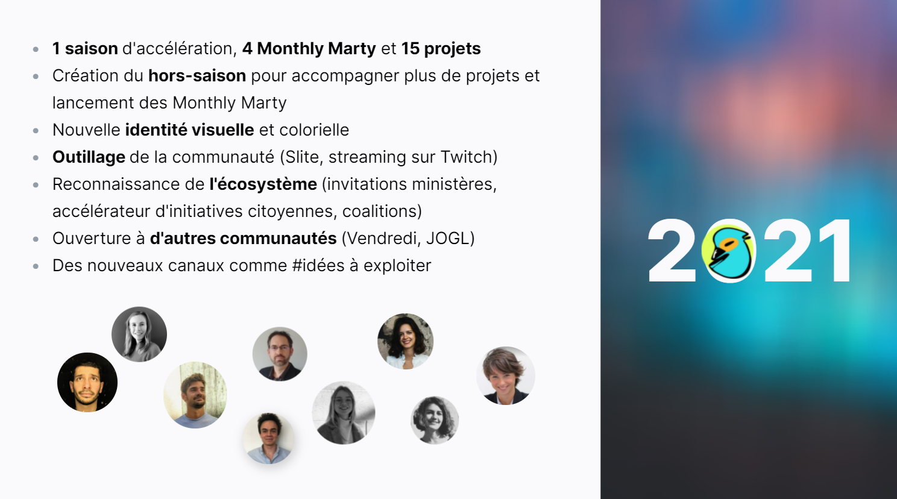
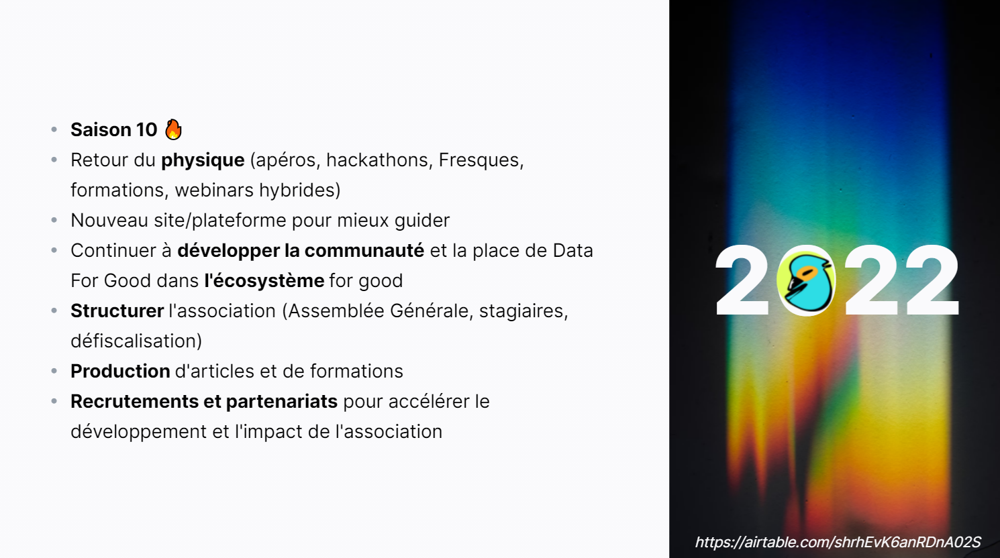
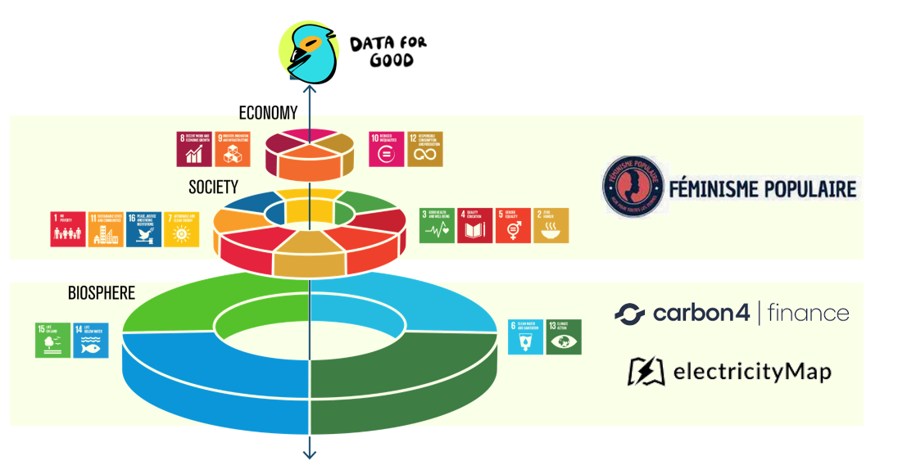
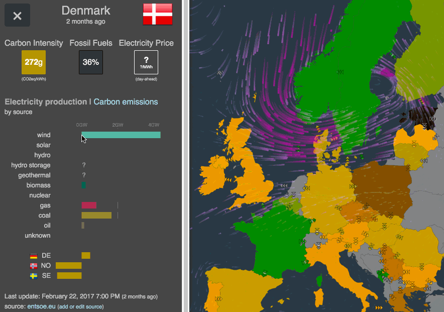

## Replay

<iframe width="100%" height="500px" src="https://www.youtube.com/embed/JaH6HPiAYSo" title="YouTube video player" frameborder="0" allow="accelerometer; autoplay; clipboard-write; encrypted-media; gyroscope; picture-in-picture" allowfullscreen></iframe>

La présentation est aussi accessible [ici](https://app.pitch.com/app/presentation/bb947ea8-f882-4f5d-bf7b-82e97581fb7b/13bdb841-4172-4939-b69a-a6eb68210bb7)

## 📰 L'actualité de l'association

### Rétrospective

#### Les accomplissements de l'année 2021

#### Les projets de 2022

### Sondage à la communauté

Pour nous améliorer en 2022, on est preneur de tous vos feedbacks positifs mais surtout nos points d'amélioration. Ensuite si tu nous veux aider à accomplir cette mission et t'engager dans l'association laisse-nous un message dans le sondage ou directement sur le Slack en envoyant un message à @Théo Alves (Data For Good) et @Benjamin Rouif .

https://airtable.com/shrhEvK6anRDnA02S

## 💪 S'engager sur un projet

Il existe de nombreux projets actuellement actifs qui recherchent tout type de profils. Pour les rejoindre, vous pouvez lire la page suivante [Comment rejoindre un projet Data For Good ?](https://slite.com/api/public/notes/IO80W9vgM/redirect)

Les canaux slacks et les besoins sont

-   \#9_codecarbon → Dev Python avec une passion pour le Hardware
-   \#mm1_mission-transition → Data Analysts / Scientists / Engineers
-   \#mm1_ogre → Développeurs Back/Front / UX Designers
-   \#mm2_bechdelai → Tous profils tech
-   \#mm2_hippocrate → Développeur web JS / UX/UI
-   \#mm3_avastar → Développeurs / Data Scientists
-   \#mm4_feminisme-populaire → Développeur, Cadrage de projet, UX/UI, n'importe qui concerné par la cause féministe et l'égalité des chances

## ✨ S'inspirer

Les 3 projets présentés pour prendre une dose d'inspiration sont à partir de 23 min dans le replay [Youtube](https://www.youtube.com/watch?v=JaH6HPiAYSo) projetés sur le Donut des Objectifs de Développement Durable

### Féminisme Populaire

<https://www.feminismepopulaire.com/>

Bouchera Azzouz est venue présenter l'association et sa lutte pour l'émancipation des femmes des quartiers populaires, et son objectif de digitaliser cette lutte pour la passer à l'échelle à l'aide d'une plateforme. Elle recherche des bénévoles pour l'aider à :

-   Cadrer le projet (chef de projet tech, product owner, UX designer)
-   Développer la plateforme et prendre les bons choix technologiques pour aller au plus vite vers le MVP (No-code ?)

Si le sujet vous intéresse on vous recommande la trilogie de films réalisé par Bouchera pour rendre hommage à ces héroines, notamment "Nos mères, Nos daronnes" sur [Vimeo](https://vimeo.com/419893736)

### Carbon4Finance

<https://www.carbon4finance.com/>

Lou Welgryn (ancienne présidente de Data For Good) est venue nous présenter son travail chez Carbon4Finance et une des manières les plus impactantes pour l'environnement d'utiliser la Data : analyser les performances environnementales des entreprises pour flécher les investissements financiers.

N'hésitez pas à lire notamment [ce rapport d'Oxfam](https://www.oxfamfrance.org/wp-content/uploads/2020/10/rapportBanque_OXFAM_v5.pdf) renseigné par les données de Carbon4Finance et à installer [l'application Rift](https://riftapp.fr/) pour mesurer l'empreinte carbone de votre épargne.

Important de retenir cette visualisation pour comprendre l'importance de la mesure du scope 3 dans les émissions carbone.

### ElectricityMap

<https://electricitymap.org/>

Olivier Corradi, CEO d'ElectricityMap est venu nous présenter l'immense projet Open Data ElectricityMap permettant d'obtenir une intensité carbone du mix électrique par pays. Projet qui est aujourd'hui utilisé par de multiples applications pour optimiser et éviter des émissions de l'électrification, par exemple Google qui utilise les données d'ElectricityMap pour mesurer et réduire l'empreinte carbone sur les services Google Cloud.

La conclusion d'Olivier est particulièrement intéressante, présentant comment il est possible de créer un projet à forte composante open source mais tout de même avoir un business model permettant d'accélérer le projet.

          