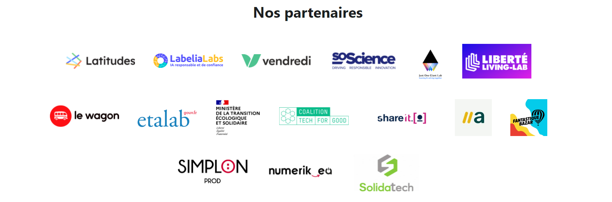
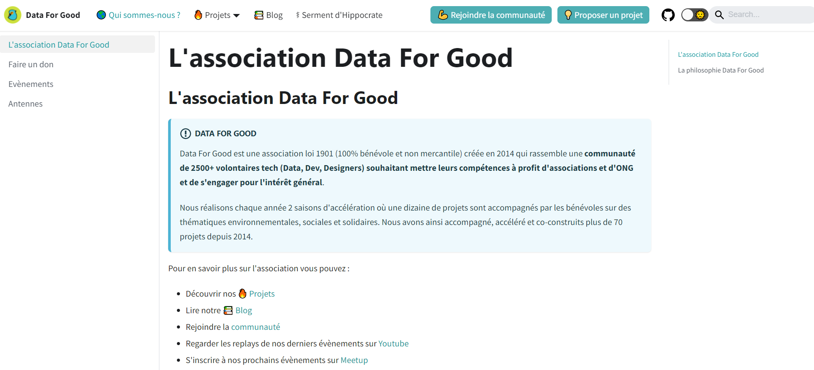
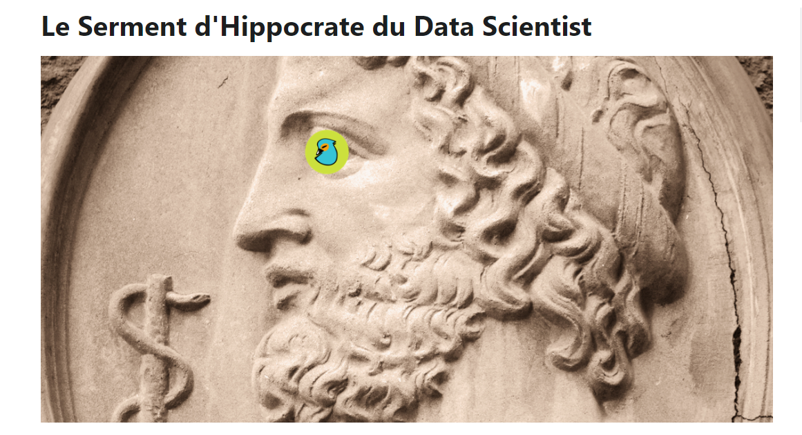
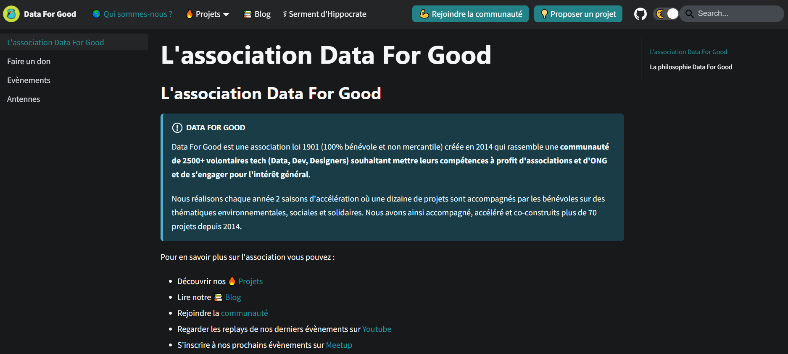
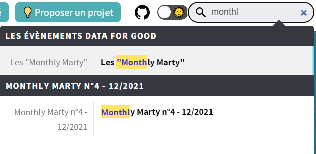
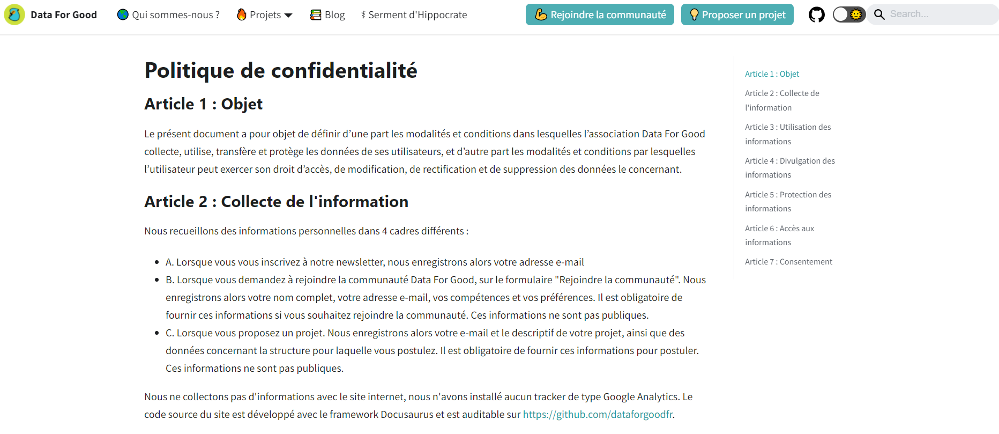

# Enfin un nouveau site !

Notre premier site internet a été réalisé en 2016 par l'excellent Frédéric Bardolle. Déjà à l'époque fier à nos valeurs open source, le site avait été réalisé avec Jekyll un générateur de site statique. Mais il n'avait été que peu mis à jour depuis 6 ans malgré l'évolution de l'association, ce qui est le comble étant une communauté de développeurs. Nous avons pris le temps à Noël de développer un nouveau site internet pour mieux valoriser nos projets et les travaux des bénévoles de l'association et rendre notre action plus impactante.  

Dans cet article nous vous présentons : 
1. Ce qui est nouveau dans ce site
2. Ce qu'on peut encore améliorer (et il y a bien des choses)
3. Comment reproduire et réutiliser ce site pour votre association

## Ce qui est nouveau dans ce site internet

### Affichage et visuels
- Nous avons corrigé la plupart des bugs d'affichage notamment sur mobile et utilisé des techniques de développement plus modernes (React via Docusaurus) pour rendre le site plus agréable en navigation tout en le rendant moins gourmant.
- Nous avons aussi pu enfin mettre en valeur la magnifique identité visuelle que Margaux nous a offert, avec notamment notre logo de martin pécheur, Marty la mascotte d'un écosystème sain et collaboratif.  

### Partenaires
Depuis 2014, Data For Good fonctionne bénévolement et de façon indépendante. Cependant beaucoup de ce qui a été fait a été permis par nos nombreux copains et partenaires de l'écosystème qui nous accompagnent, nous encouragent et nous inspirent. Nous pouvons enfin leur rendre honneur en les mettant au bon endroit sur notre site

 

### L'équipe Data For Good
Mais qui sont les têtes qui passent leur matin, soir et weekend sur leur temps personnel pour faire vivre l'association. De la même manière que les partenaires, vous pouvez maintenant voir ceux qui se cachent dans l'ombre de l'association à créer les repositories github et organiser ces saisons d'accélération. 

### Les projets Data For Good
L'association s'est construite autour de projets, pourtant dans le précédent site il était difficile de comprendre comment s'engager, voir les projets déjà effectués, ou bien retrouver le github de chaque projet. Nous avons mis un premier coup de pinceau pour rendre ces projets plus accessibles. 

Les logos sont visibles depuis la page d'accueil et permettent de rediriger vers les bons projets

La page [projets](/projects) permet de retrouver tous les projets qui sont indexés par tags, saisons, hors saisons et même ODDs (Objectifs de Développement Durable) de l'ONU. 

En cliquant sur les tags ou les ODDs vous pouvez filtrer et retrouver facilement tous les projets sur le climat, tous les projets actifs ou bien tous les projets de la saison 10. 

### Les détails de l'association
Qui est l'association ? Que sont les antennes ? Comment faire un don ? Comment contacter l'association ? Vous avez sûrement beaucoup de questions sur l'association qui est assez peu transparente (parce que nous ne trouvons pas le temps de tout écrire étant nous même bénévoles et nous nous en excusons). Nous avons commencé à compiler des informations et des réponses à vos questions dans un onglet "détails" pour [essayer de tout vous expliquer sur l'association](https://dataforgood.fr/docs/dataforgood).

Pour l'instant tout n'est pas encore renseigné mais nous faisons un maximum !

### Le blog
Nous rapatrions le blog Data For Good qui était avant sur Medium à l'intérieur de ce site (exactement là vous êtes en train de lire ce post), ce qui nous permet de mieux maitriser et rester propriétaire de notre contenu, de ne pas dépendre d'une plateforme logicielle externe (et donc de rester fidèle à nos valeurs open source), et au passage d'avoir un blog fait de pages statiques et donc d'être moins énergivore.

### Le Serment d'Hippocrate est de retour !
Un de nos projets les plus emblématiques, qui [avait fait pas mal de bruit à sa sortie en 2018](https://www.lemonde.fr/festival/article/2018/07/05/un-serment-d-hippocrate-pour-les-professionnels-de-l-intelligence-artificielle_5326218_4415198.html), était le [Serment d'Hippocrate du Data Scientist](/hippocrate) - une charte d'engagement éthique pour les professionnels de la Data. 

Suite à des problèmes d'hébergement, nous avions perdu le site internet de ce serment qui n'était plus accessible depuis 1 an et demi. Après avoir fait de l'archéologie nous avons pu le [remettre en ligne sur ce site](/hippocrate), ce n'est plus tout à fait aussi beau et il manque encore les signataires mais au moins il est accessible et peut être utilisé et améioré 🙏  

### Dark Mode !
Un feature bien connu des développeurs, en cliquant en haut à droite sur la lune, vous pouvez maintenant mettre le site en dark mode. 

### Barre de recherche
Cela peut servir également, mais une barre de recherche est maintenant disponible pour trouver la réponse à (toutes?) vos questions. 

### Politique de Confidentialité
Un point primordial mais que nous n'avions toujours pas, nous avons enfin écrit une politique de confidentialité pour vous expliquer ce que nous faisons avec vos données (Spoiler, nous en récupérons très peu et nous n'en faisons rien, et n'en ferons jamais rien à part éventuellement vous contacter pour vous proposer un projet). Mais c'était important d'être exemplaire sur ce point. 

Nous avons encore des progrès à faire, notamment nous allons mettre en place des moyens simples pour gérer le droit à l'oubli sur vos données (aujourd'hui on doit encore le faire manuellement, d'ailleurs si vous le souhaitez c'est par mail à contact@dataforgood.fr).

## Que pouvons-nous améliorer sur ce site ?
Comme mentionné plus haut, nous n'avons pas encore eu le temps de tout faire, et nous aimerions d'ici peu développer les points suivants. Si vous êtes intéressés pour nous aider, nous accueillons avec grand plaisir votre aide 💪 

### Finaliser le site

- Tous les projets ne sont pas remplis, nous allons faire de la spéléologie pour aller chercher des informations et les mettre à jour sur le site, si vous êtes concernés par ces projets envoyez-nous un message pour remplir ces fiches avec nous ! 
- Nous aimerions avoir une section accessible en anglais pour tous nos ami.e.s non francophones qui nous demandent souvent comment ils pourraient contribuer à la communauté
- Nous aimerions aussi rapatrier nos documents

### Eco-conception, inclusion et accessibilité

- Nous avons appliqué des principes de base d'écoconception, sans sombrer aux sirènes de frameworks de développement web énergivores. Le site est développé en React mais avec une surcouche de générateurs de sites statiques appelée [Docusaurus](https://docusaurus.io/), ce qui nous permet d'avoir un site principalement avec des fichiers textes (Markdown pour les développeurs), et donc très peu énergivores car ne faisant aucuns appels serveurs pour passer d'une page à une autre ou afficher un contenu plus complexe. Tout le site est resté par construction assez sobre. La barre de recherche est statique également et ne fait appel à aucun outil de recherche énergivore comme Algolia. Les images sont précompilées pour réduire leur taille. Nous n'utilisons pas non plus de tracker comme Google Analytics pour minimiser les appels serveurs, ne pas vous embêter avec les cookies (oui, oui, nous ne stockons rien sur le site internet, nada !) 
- MAIS, nous n'avons pas encore eu le temps de mesurer la performance de notre site et de 1. continuer à l'optimiser 2. partager avec la communauté les bonnes pratiques que nous aurions identifié.  En particulier notre hébergeur est (et depuis toujours) Github et nous ne maitrisons pas où est fait l'hébergement du site (certes peu volumineux, mais c'est important de regarder).
- Egalement, nous n'avons pas eu le temps de prendre en compte toutes les considérations d'inclusion et d'accessibilité, nous nous excusons par avance si vous n'avez pas accès à certains documents, et nous ferons le maximum pour s'améliorer !

### D'autres idées ?
Si vous avez une idée, voyez un bug, ou souhaitez contribuer au développement du site ou la rédaction d'articles, envoyez nous un mail à contact@dataforgood.fr ou sur [Slack](/join)

## Comment répliquer ce site pour votre association ?

L'intégralité du site est open source et accessible à ce [lien Github](https://github.com/dataforgoodfr/dataforgoodfr.github.io). Vous pouvez absolument tout réutiliser pour réaliser votre site pour votre association. Si vous avez accès à des développeurs, ça sera 100% gratuit même pour l'hébergement des pages statiques qui est offert sur Github. Si vous n'avez pas accès à des développeurs, [contactez nous](mailto:contact@dataforgood.fr) et on pourra sûrement vous aider ;)   