# Mesurer la réaction publique et médiatique à la sortie du nouveau rapport du GIEC

## Introduction

### Comprendre le 2e volet du rapport du GIEC

Le GIEC (Groupe d’experts Intergouvernemental sur l’Evolution du Climat) a publié lundi 28 février 2022 le 2e volet du 6e rapport (aussi appelé AR6). Quand le premier traitait de l'état des connaissances sur l'évolution physique du climat, ce deuxième traite de l'impact du changement climatique sur les sociétés, les humains, et les écosystèmes.

Nous ne reviendrons pas sur toutes les conclusions de ce rapport qui vous seront mieux racontées par cet [excellent article](https://vert.eco/articles/les-principales-lecons-du-nouveau-rapport-du-giec-sur-les-impacts-de-la-crise-climatique) sur Vert.eco ou cette [vidéo de Paloma Moritz et Camille Etienne](https://www.youtube.com/watch?v=LRpNlVZ-YOs&ab_channel=BLAST%2CLesouffledel%27info) sur Blast, en quelques mots pour citer l'article de Vert.eco: 

:::warning Les principales conclusions du rapport résumées par [Vert.eco](https://vert.eco/articles/les-principales-lecons-du-nouveau-rapport-du-giec-sur-les-impacts-de-la-crise-climatique)

- Les impacts du changement climatique sont généralisés et, pour certains, irréversibles
- Le climat, les humains et les écosystèmes sont interdépendants
- Il faut limiter le réchauffement à 1,5°C pour que les dégâts restent gérables
- L’Europe ne sera – évidemment – pas épargnée
- Les impacts dépendent fortement de l’état social et économique des sociétés
- Les mauvaises solutions aggravent le réchauffement climatique
- Les bonnes solutions incluent nécessairement un développement équitable et juste
:::

Comme le souligne également [Bon Pote](https://bonpote.com/33-milliards-detres-humains-exposes-au-changement-climatique-le-nouveau-rapport-du-giec-est-sans-appel/), avec 3,3 milliards d'êtres humains exposés au changement climatique, ce rapport traite également de justice sociale, de dette climatique, de l'impact sur la santé humaine, de biodiversité, d'atténuation, de pertes et de dommages, et surtout du coût de l'inaction climatique. Retrouvez les 12 points principaux dans cette [superbe infographie de Bon Pote](https://bonpote.com/les-infographies-du-6eme-rapport-du-giec/) mis en valeur par Sydney Thomas

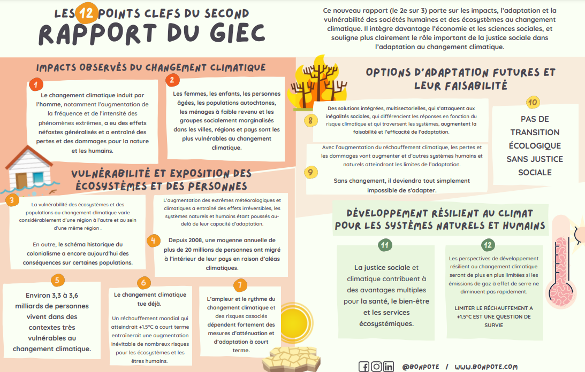

Cependant avec l'actualité morose du moment, ce rapport aux conclusions fracassantes n'a eu que peu de retombées et très (très) peu de retours médiatiques. **Peut-on quantifier plus précisément son impact sur le public ?**

> Pour en savoir plus sur le rapport, nous avons préparé une [section dédiée 🖐](/blog/giec#pour-en-savoir-plus-sur-le-nouveau-rapport-du-giec)

### Quantifier l'impact du rapport sur le public 
Cet article cherche à **quantifier l'impact du rapport sur le public** en *analysant l'ensemble des publications Twitter sur le rapport* en utilisant des méthodes d'analyse de données et de traitement de texte. En effet en comprenant mieux les réactions et les émotions autour du rapport, il est peut-être possible de comprendre **comment mieux partager les conclusions, d'identifier les éléments à vulgariser et à expliquer, et donc de soutenir cette action militante de diffusion.**. 

Nous allons aussi **comparer la réaction publique à la sortie du premier volet du rapport du GIEC**, ainsi qu'à d'autres actualités pour pouvoir comparer. Nous essayerons également de **quantifier la part médiatique de cette réaction afin de mesurer la part d'information due aux militants et activistes et la part due aux médias**. 

## Les conclusions de l'analyse
L'analyse *décrite en détail ci-dessous* porte sur une analyse automatisée de 48000 tweets autour des deux premiers rapports du GIEC en France et à l'international, afin de quantifier l'impression que ce rapport n'a pas l'attention qu'il devrait probablement avoir. Nous avons ainsi pu mettre en valeur les points principaux suivants : 

:::tip Les principales conclusions de l'analyse
- Le deuxième rapport du GIEC a provoqué **significativement moins de réaction du public** (-60% par rapport au premier)
- "L'engouement" autour du rapport **diminue sensiblement après les 3 premiers jours** (à moins d'un évènement médiatique marquant pour relancer la machine, 95% des publications ont déjà été faites)
- Les publications les plus plébiscitées et qui sensibilisent le plus grand nombre sont celles des **activistes en France comme à l'international**
- Nous confirmons sur les réseaux sociaux une **quasi absence de traitement politico-médiatique** autour de ce second rapport, dissonance notablement plus marquée en France qu'à l'international
- La plupart des publications sur le sujet partagent ce second rapport de façon très factuelle, mais un nombre significatif de discussions creusent les sujets les plus forts du rapport (adaptation et vulnérabilité, impact sur les populations indigènes, dette climatique, détérioration des écoystèmes)
- Il semble y avoir une prise de conscience publique plus forte qu'après le 1er rapport quant à l'**importance de l'inaction climatique**, avec au moins autant d'espoir autour de nos futurs désirables si l'on agit maintenant que d'effroi devant l'impassibilité des décideurs politiques et le constat glaçant de ce rapport. 

:::

## L'analyse

:::info Le scope de l'analyse
Pour bien comprendre cet article, il faut noter le scope de l'analyse. Les données étudiées sont **tous les tweets portant la mention d'un hashtag #IPCC ou #GIEC** *publiés d'une semaine avant la sortie d'un rapport jusqu'à 1 semaine après la sortie du rapport*. 

Autrement dit ce sont tous les tweets : 
- Pour le 1er volet (appelé plus bas WG1) du 2021-08-02 au 2021-08-16 (non inclu), le volet étant sorti le 2021-08-09
- Pour le 2eme volet (appelé plus bas WG2) du 2022-02-21 au 2022-03-07 (non inclu), le volet étant sorti le 2022-02-28

:::

:::caution A propos des biais d'une analyse Twitter
Les analyses Twitter comportent des biais importants, la population sur Twitter est une population non-représentative des citoyens. Gardez en tête ces biais pour rester critique sur les conclusions de cette analyse. 

De plus nous analysons uniquement les tweets portant le hashtag #GIEC ou #IPCC, il peut ainsi manquer tous les tweets mentionnant le GIEC dans le corps du texte et non comme un hashtag. Par exemple, il semble manquer les tweets de ceux qui engagent la discussion plus profondément sur le sujet comme Bon Pote ou Valérie Masson Delmotte qui n'utilisent pas forcément à chaque tweet le hashtag #GIEC.
:::


### Des premières statistiques

- **48000 tweets ont été publiés** sur les deux semaines autour de la sortie des deux volet, dont 33k pour le 1er volet et 15k pour le 2e volet. Cela représente donc une **baisse de -60% du nombre de réactions sur Twitter entre les deux rapports**

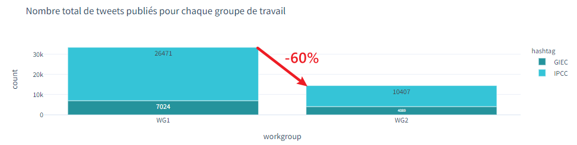

- 95% des tweets ont lieu après la sortie du rapport

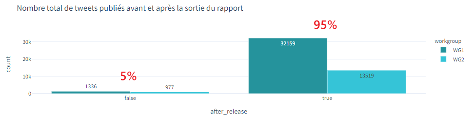

- On voit vite "l'engouement" s'effondrer au fur et à mesure des jours après la sortie d'un rapport. Après l'effet du lancement le nombre de publications diminue très vite. 

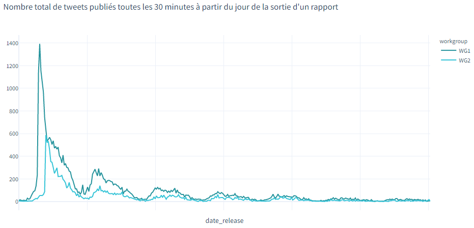

- Si on regarde le nombre de tweets par jour après la sortie d'un rapport, on constate donc que **plus de 50% des tweets sont publiés le jour du lancement du rapport**, 20% le deuxième jour, 10% le 3e jour. Ainsi on observe que **90% des tweets sont déjà publiés au 4e jour**. 


- 45% des tweets mentionnant le hashtag #IPCC sont en anglais. La plupart des tweets français utilisent plutôt le hashtag #GIEC


### Quels utilisateurs ont été les plus influents ? 

Le nombre de likes et retweets sur Twitter sont des bons indicateurs pour juger de l'influence d'un utilisateur, mais surtout pour imaginer la portée et la viralité de son message une fois twitté. 

- On observe ainsi les 20 premiers influenceurs suivant pour les deux volets du rapport, parmi lesquels le compte officiel de GIEC, les activistes Greta Thunberg ou Luisa Neubauer, Greenpeace et son porteparole Clément Sénéchal, Michael Mann, ou Mickael Correia. Quelques remarques:
    - Dès que Greta Thunberg poste un message, la portée de son message est énorme, on remarque qu'elle n'avait pas posté pour le 1er volet en août
    - En France, on remarque la même situation avec Thomas Pesquet qui n'a malheureusement pas posté pour le 2eme volet

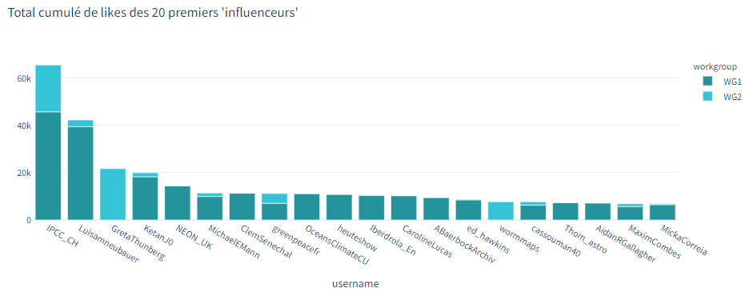

- En regardant précisément le nouveau rapport sorti début mars, on peut remarquer que les influenceurs internationaux les plus populaires sont des auteurs du rapport comme Colin J Carlson), Al Gore, et de nombreuses et nombreux activistes.  


- En regardant maintenant les influenceurs français sur le second volet du rapport, on retrouve notamment: 
    - JulieBetax avec son [tweet sur la place du nouveau rapport dans les médias](https://twitter.com/JulieBetax/status/1499718343024066560)
    - Des personnalités politiques (Yannick Jadot, Sandrine Rousseau, François Ruffin, L'insoumission)
    - Des personnalités et associations activistes et militantes (Teïssir, Cyril Dion, Stacy Algrain, ANV-COP21, Réseau Action Climat, Adrien Bncn)
    - Des journalistes engagées (Audrey Garric, Paloma Moritz et Blast France)
    - Des scientifiques (Christophe Cassou)
    - Un flash info (Cerfia)


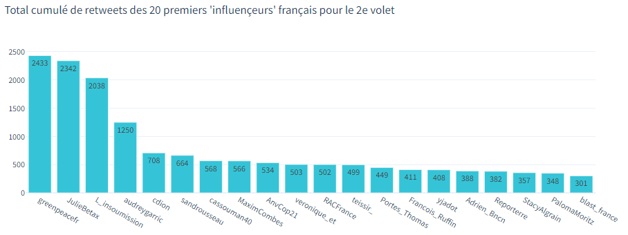

- *Malheureusement, ce ne sont que peu de réactions, il sera bon de comparer avec une personnalité politique comme Eric Zemmour qui peut atteindre 75000 likes sur une journée sur Twitter, les tweets d'Emmanuel Macron peuvent eux atteindre 25000 likes sur un même post.*

### Quels tweets ont été les plus likés et partagés ?
Il est aussi intéressant d'étudier les messages qui ont fait le "plus" réagir.

- A l'international, on retrouve les tweets officiels du GIEC, les messages percutants de Greta Thunberg et d'Al Gore implorant un passage à l'action, ainsi que des messages de vulgarisation pour apprendre comment décrypter un rapport scientifique tel que celui du GIEC

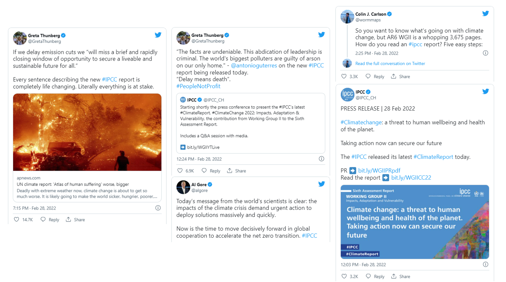

- En France, on retrouve en premières places **beaucoup de second degré** (mauvais jeu de mot sachant qu'on se doit de limiter le réchauffement à 1.5°C) **sur le traitement inexistant du sujet par les médias et les politiques**


- On retrouve notamment l'esprit du tweet caustique de Greta Thunberg, tweet le plus liké et partagé de la COP26 à raison (*une analyse similaire est en préparation de la réaction du public à la COP26*)

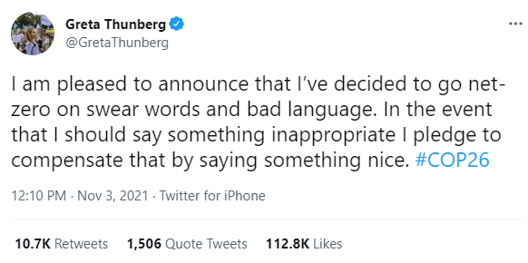

### Quels sont les thématiques abordées ?

pour comprendre les thématiques abordées au sein des différents tweets, nous pouvons explorer ces infographies en nuage de mots. *Construits pour mettre en valeur les mots ou expressions les plus mentionnées* : 

Pour les tweets en français à propos du second rapport, on retrouve notamment de nombreux éléments du rapport (vulnérabilité, adaptation, crise climatique, justice sociale, urgence climatique), l'actualité ayant lieu en parallèle (guerre en Ukraine, présidentielle 2022), mais aussi le traitement politico-médiatique du rapport (Don't Look Up, médias, politique). 

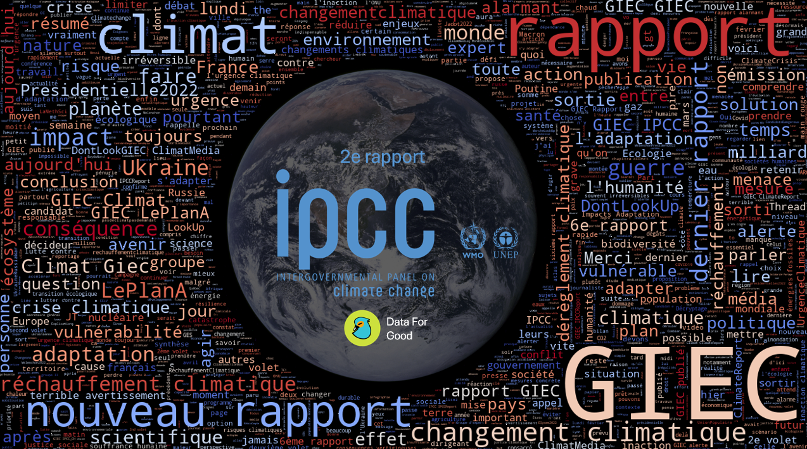

Pour les tweets en anglais à propos du second rapport, on retrouve les mêmes thématiques avec moins d'importance autour des médias, et plus de mentions à l'action climatique (*Climate Action, Now, Climate Response*)

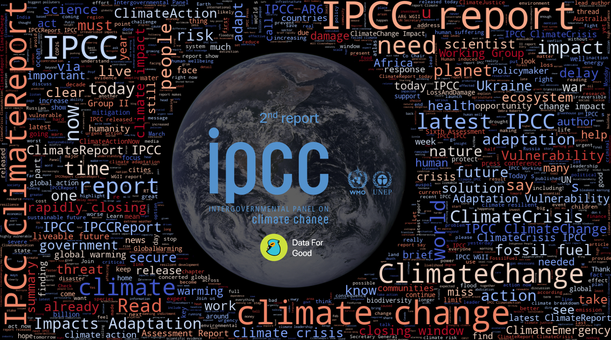

Pour le premier rapport en français, on retrouvait des thématiques plus scientifiques, mais on retrouvait effectivement le transfert de Messi au PSG subvenu au même moment et déspérant les militants qui voyaient ce sujet infiniment plus médiatisé que ce premier rapport.

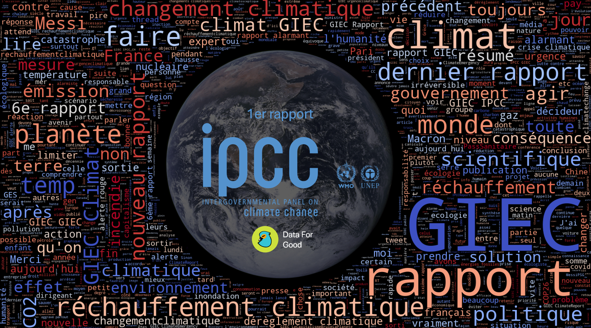

Pour aller plus loin, il est possible d'utiliser des algorithmes de traitement de texte (NLP) pour analyser plus dans le détail les thématiques et les regrouper ensemble. (Pour les développeurs, nous utiliserons [bertopic](https://maartengr.github.io/BERTopic/index.html)). On obtient les thématiques les plus discutées par ordre d'importance :

:::info Les thématiques les plus discutées sur Twitter à propos du second rapport du GIEC

1. L'actualité et le partage très factuel de la sortie du rapport occupe la moitié des discussions 
2. La guerre en Ukraine en 2e position
3. Les sujets d'adaptation et de vulnérabilité
4. L'impact sur les populations indigènes
5. Le prix et le marché du carbone
6. La finance et la dette climatique
7. Les ressources en eau douce
8. La biodiversité et la protection des écosystèmes  
9. Les risques sur les océans et la biodiversité marine
10. Les risques de l'inaction climatique 

:::


### Quelles émotions ont été partagées ? 
Il est possible d'utiliser des algorithmes de traitement de texte (NLP) pour analyser les émotions pressenties derrière un tweet. En particulier l'université de Cardiff a développé un ensemble d'algorithmes pré-entrainés (et donc réutilisables simplement) en open source dans la bibliothèque de modèles Hugging Face https://huggingface.co/cardiffnlp. Ces algorithmes ont été entrainés à détecter des émotions à partir d'un dataset de 58 millions de tweets labellisés. Ainsi **il est possible de déceler certaines émotions avec une fiabilité assez intéressante : la joie, la colère, la tristesse, l'ironie, l'optimisme.**

Que donnent donc ces algorithmes sur les réactions au rapport du GIEC ? (*Malheureusement, ces algorithmes ne sont disponibles qu'en anglais, nous prendrons donc les 2200 tweets en anglais faisant mention du 2e rapport du GIEC avec au moins 5 likes*). 2/3 de réactions de tristesse et de colère, mais 1/3 tout de même avec un peu d'optimisme.

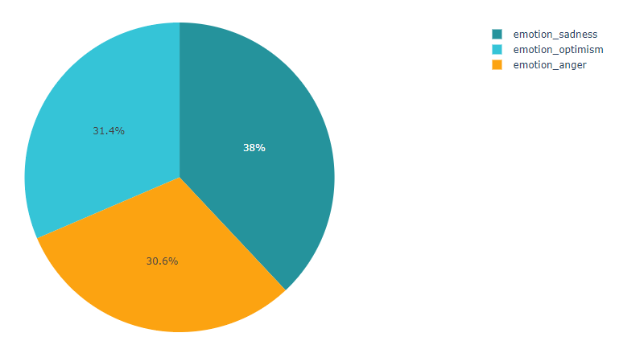

Dans les émotions négatives de tristesse et de colère les plus marquées, on retrouve notamment les réactions aux déclarations sur l'inaction climatique d'Antonio Guterres.


Nous pourrons **finir cette étude avec les émotions positives de joie, d'humour, de coopération et d'optimisme**. Parmi les émotions les plus fortes, on retrouve l'excellent Timothée Parrique qui propose de vulgariser le rapport avec des "chats mignons", des activistes qui se réjouissent d'une action réussie, et de l'optimisme sur les conclusions du GIEC sur les possibilités et l'espor qu'il reste à agir maintenant !

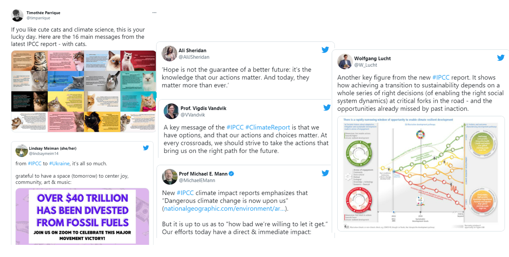


### Pour aller plus loin
Il est possible d'aller beaucoup plus loin dans l'analyse, cette section s'adresse notamment aux développeurs qui souhaiteraient creuser certains éléments, par exemple en creusant la viralité des publications, en analysant les conversations, ou bien en étudiant d'autres moments clés (nous avons constitué un dataset pour la COP26 de Novembre 2021 d'1M de tweets, [contactez-nous pour y avoir accès](mailto:theo.alves.da.costa@gmail.com)).


## Pour en savoir plus sur le nouveau rapport du GIEC

##### Pour un résumé "rapide"
- Le [décryptage du deuxième volet du rapport](https://vert.eco/articles/les-principales-lecons-du-nouveau-rapport-du-giec-sur-les-impacts-de-la-crise-climatique) par Juliette Quef et Loup Esparguilière pour Vert.eco
- Le [décryptage de Bon Pote](https://bonpote.com/33-milliards-detres-humains-exposes-au-changement-climatique-le-nouveau-rapport-du-giec-est-sans-appel/)
- Le [décryptage de Makesense](https://france.makesense.org/media/rapport-du-giec-acte-2-scene-1-adaptation-mon-amour/) par Hélène Binet
- Le [décryptage de Stacy Algrain et Nicolas Dubois](https://www.instagram.com/p/CajgU5NL10O/) en infographie sur Instagram

##### Pour aller plus loin
- L'[excellente vidéo explicative](https://www.youtube.com/watch?v=LRpNlVZ-YOs&ab_channel=BLAST%2CLesouffledel%27info) de Paloma Moritz et Camille Etienne pour Blast
- Le [fameux résumé à l'intention des décideurs](https://report.ipcc.ch/ar6wg2/pdf/IPCC_AR6_WGII_SummaryForPolicymakers.pdf) (Summary for Policy Makers - SPM) du GIEC

##### Pour aller beaucoup plus loin
- Le [résumé technique](https://report.ipcc.ch/ar6wg2/pdf/IPCC_AR6_WGII_FinalDraft_TechnicalSummary.pdf) du GIEC de 96 pages
- Le [rapport complet](https://report.ipcc.ch/ar6wg2/pdf/IPCC_AR6_WGII_FinalDraft_FullReport.pdf) du GIEC de 3675 pages 

##### Sur le traitement médiatique autour du rapport du GIEC
- L'[inquiétant traitement médiatique de la sortie du rapport du GIEC](https://vert.eco/articles/giec) sur Vert.eco

##### Pour en savoir plus sur le GIEC
- [Synthèse et analyse du 1er rapport du GIEC](https://bonpote.com/synthese-et-analyse-du-nouveau-rapport-du-giec/) par Bon Pote
- [Climat : peut-on vraiment faire confiance au GIEC ?](https://bonpote.com/climat-peut-on-vraiment-faire-confiance-au-giec/) par Bon Pote


## Pour les développeurs
L'ensemble de cet article s'appuie du code publié en open source ici https://github.com/dataforgoodfr/climatewatch, et utilise lui même un ensemble de technologies open source : snscrape, bertopic, huggingface, vader, tensorflow, codecarbon, nltk, flashtext. 

Le code est open source mais peu documenté, postez une issue Github en cas de besoin. Les étapes de l'analyse sont décrites ci-dessous et constituent les notebooks Python du dossier présent sur Github : 
- Récupérer une base de données de tweets avec les commandes suivantes
```
poetry run snscrape --jsonl twitter-search "#IPCC since:2022-02-21 until:2022-03-07" > ./data/IPCC2.json
poetry run snscrape --jsonl twitter-search "#GIEC since:2022-02-21 until:2022-03-07" > ./data/GIEC2.json
poetry run snscrape --jsonl twitter-search "#IPCC since:2021-08-02 until:2021-08-16" > ./data/IPCC1.json
poetry run snscrape --jsonl twitter-search "#GIEC since:2021-08-02 until:2021-08-16" > ./data/GIEC1.json
```
- Nettoyer les tweets, concaténer les fichiers
- Prédire le sentiment en utilisant VaderSentiment
- Prédire les émotions en utilisant les modèles pré-entrainés Bertweet de l'université de Cardiff (réalisé ici sur Google Colab pour utiliser un GPU)
- Analyser les sujets de discussions en utilisant Bertopic
- Analyser l'ensemble des données

## A propos 

### Empreinte carbone des analyses
L'analyse de données et les algorithmes sont parfois incompatibles avec un monde soutenable. Il était donc nécessaire de s'assurer que l'impact environnemental de ces analyses ne serait pas trop élevé. Le volume de données n'est que peu conséquent, mais nous avons tout de même pris soin de **mesurer l'empreinte carbone de l'exécution du code** et de le **réduire**.
- Pour mesurer l'empreinte de notre code, nous avons utilisé [CodeCarbon](https://codecarbon.io/), projet accéléré par Data For Good à la saison 9, qui permet simplement de mesurer pour un développeur l'empreinte de son travail. Nous trouvons donc une **empreinte finale de 199gCO2e**, soit pas grand chose : 1km en voiture ou 110km en train (selon l'[excellent convertisseur Datagir](https://monconvertisseurco2.fr/?co2=1)), en effet la seule phase émissive était l'utilisation de GPUs sur Google Colab sur un serveur cloud distant pour une sous-partie minime de l'analyse sur les émotions (~20min de calculs sur le GPU le moins consommateur). Pour en savoir plus, le fichier ``emissions.csv`` est mis à disposition sur Github. 
- Pour réduire, nous avons fait plusieurs choix de modélisations et ce avant même de constater une éventuelle surconsommation : 
    - Se concentrer sur la partie la plus utile de l'analyse qui ne fait pas appel à des algorithmes compliqués et peut tourner sur un simple ordinateur portable
    - Pour la partie émissive, réduire le volume de données, utiliser des algorithmes pré-entrainés adaptés et les plus frugaux possibles, et utiliser les GPUs les moins consommateurs

### Data For Good

Data For Good est une association loi 1901 (100% bénévole, 100% open-source, 100% citoyenne) créée en 2014 qui rassemble une communauté de 2700+ volontaires tech (Data Scientists, Data Analysts, Data Engineers, Developers, UX/UI Designers, Product & Project Owners) souhaitant mettre leurs compétences au profit d'associations, d'ONG, et de l'ESS - et de s'engager pour l'intérêt général.

Nous réalisons chaque année des saisons d'accélération où une dizaine de projets sont accompagnés par les bénévoles sur des thématiques sociales, sociétales et environnementales. Nous avons ainsi accompagné, accéléré et co-construits plus de 100 projets depuis 2014.

Nous sommes également fervents critiques des risques et des dérives de la technologie, faire partie de la communauté est aussi s'engager pour une technologie sobre et respectueuse des enjeux sociaux et environnementaux, et accepter que la technologie n'est pas la solution à tous les problèmes.

🖐 La saison 10 de projets Data For Good commence par ailleurs le 12 mars https://app.livestorm.co/data-for-good/saison10?type=detailed 