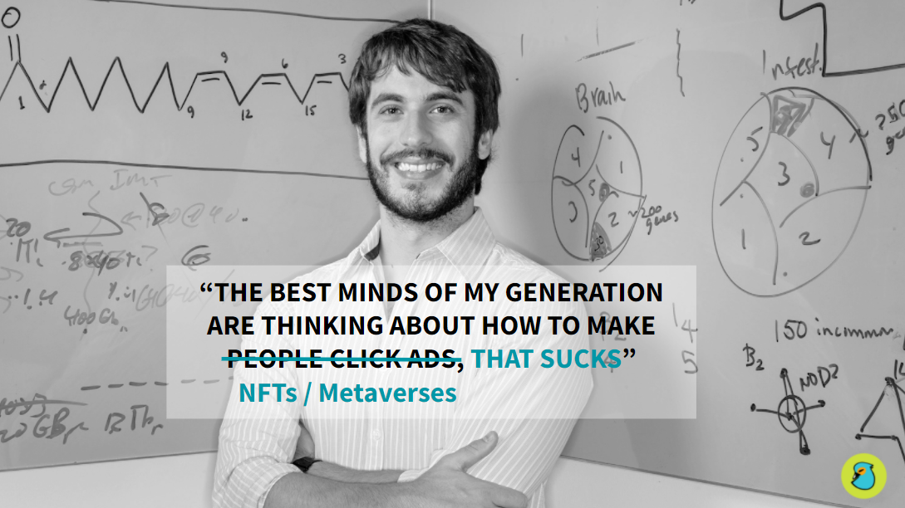
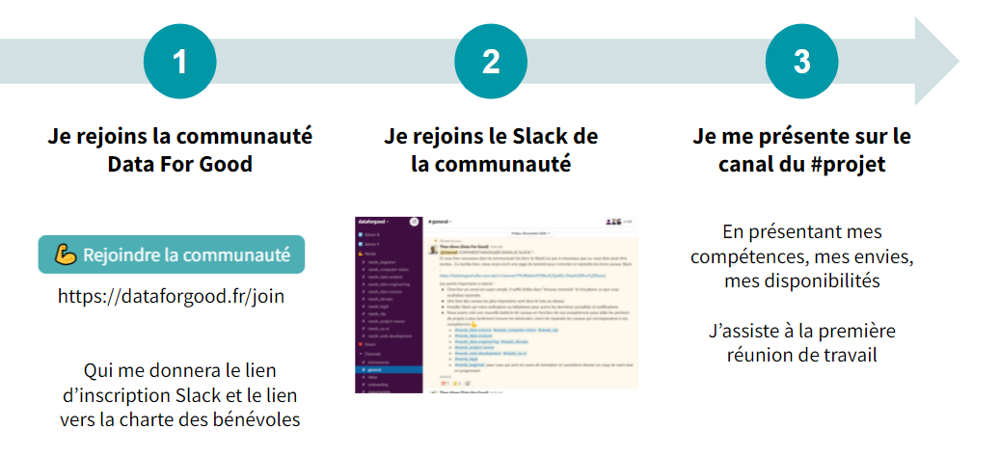

# Lancement de la saison 10 Data For Good

🎬 Clap !

C'est parti pour la saison 10 de l'association Data For Good, après 9 saisons, plus de 80 projets et 2800 bénévoles, nous sommes repartis pour 3 mois d'accélération citoyenne de projets d'intérêt général pour aider les grandes causes sociales et environnementales. 

Vous retrouverez dans cet article l'ensemble des informations pour tout savoir sur la saison et les projets qui sont proposés aux volontaires, et pour rejoindre la communauté et proposer son aide sur un projet 💪

<iframe width="100%" height="500px" src="https://www.youtube.com/embed/bnAXCjD2l80" title="YouTube video player" frameborder="0" allow="accelerometer; autoplay; clipboard-write; encrypted-media; gyroscope; picture-in-picture" allowfullscreen></iframe>

Vous pouvez également [parcourir la présentation ici](https://docs.google.com/presentation/d/1OaRajbh2aSoVf-vXkAhLogp1zdLDps450WcSfXpBkdg/edit?usp=sharing) 🖐

## L'association Data For Good

Nous en avons profité pour mettre à jour notre citation préférée 👇

Data For Good est une association loi 1901 (100% bénévole, 100% open-source, 100% citoyenne) créée en 2014 qui rassemble une communauté de 2800+ volontaires tech (Data Scientists, Data Analysts, Data Engineers, Developers, UX/UI Designers, Product & Project Owners) souhaitant mettre leurs compétences au profit d'associations, d'ONG, et de l'ESS - et de s'engager pour l'intérêt général.

Nous réalisons chaque année des saisons d'accélération où une dizaine de projets sont accompagnés par les bénévoles sur des thématiques sociales, sociétales et environnementales. Nous avons ainsi accompagné, accéléré et co-construits [plus de 100 projets](/projects) depuis 2014. Vous pouvez en savoir plus sur la [page principale](/)

## La saison 10

### La philosophie de la saison 

Pour cette 10e saison, nous avons essayé de vous proposer des projets d'intérêt général variés sur l'ensemble des causes sociales et environnementales, et dont **l'impact positif pour la société et l'environnement peut être énorme, avec une maturité suffisante pour atteindre ces objectifs**. 

Ainsi nous avons sélectionné des *projets que nous connaissons des saisons précédentes, du hors-saison et quelques nouveautés* ! 

Cependant cela ne suffit pas, réaliser des projets "for good" qui ont un réel impact n'est pas si évident. **Il est primordial de prévoir, anticiper, sensibiliser, mesurer, et réduire les externalités négatives des projets et des technologies et algorithmes sous-jacents**. Ainsi, pour cette saison nous allons compléter notre [Serment d'Hippocrate](/hippocrate) pour créer une boite à outil de mesure d'impact négatifs des projets technologiques. Par exemple tous les projets de la saison qui codent en Python vont devoir mesurer l'empreinte carbone du code avec [CodeCarbon](/projects/codecarbon) (Saison 9). 

### Le déroulé de la saison

La saison 10 se déroule sur 3 mois à compter du 12 mars, nous allons essayer de maintenir un format hybride pour permettre à la fois à tout le monde de participer, mais de se retrouver également en présentiel au Liberté Living Lab pour échanger, travailler et débattre !

## Les 9 projets de la saison 10

Le détail des projets est [accessible ici sur le site](/projects/tags/saison-10) 🖐

### 🍞 Solinum

:::info Diagnostiquer l'aide alimentaire

Proposer des dashboard de données analytiques pour les associations et les pouvoirs publics, permettant d'observer en un clin d’oeil les besoins des territoires sur l’aide alimentaire**

:::

#### A propos de Solinum

[Solinum](https://www.solinum.org/) (et le Soliguide) est une association qui lutte contre la pauvreté en permettant aux personnes en situation de précarité qui d’obtenir des informations pour s’orienter et donc d’accéder à des lieux et services utiles. Aujourd'hui le Soliguide référence des lieux d'accueil, santé, alimentation, hygiène, emploi, matériel, et autres activités gratuites. **Et si au lieu d’attendre 2 ans d’avoir un rapport, les décideurs avaient accès aux données pertinentes en temps réel** ?

#### Le projet : diagnostiquer l'aide alimentaire
- **L’objectif : proposer des dashboard de données analytiques pour les associations et les pouvoirs publics, permettant d'observer en un clin d’oeil les besoins des territoires sur l’aide alimentaire**.
- Exemple : Analyse de l’adéquation besoin/offre ; fermeture des structures en août ; carte isochrone d’accessibilité ; comparaison entre les territoires ; etc.
- Les données : 
    - Structures référencées sur Soliguide : 40 000 services dont 3163 services d'aide alimentaire (742 distribution de repas, 451 restauration assise, 1520 colis alimentaires, 450 épiceries sociales et solidaires)
    - Recherches faites sur Soliguide
    - Données ouvertes (taux de pauvreté INSEE ; nb de bénéficiaires du RSA ; …)

#### Compétences recherchées
- Data Analystes de tous niveaux avec une appétence pour la visualisation et les projections géospatiales !
- Data Scientists et Data Engineers pour aller chercher des données supplémentaires et automatiser les traitements et les visualisations  

#### Pour en savoir plus
Vous pouvez visiter la page du projet [Solinum](/projects/solinum) et rejoindre le canal Slack #10_solinum !

### 🎬 Collectif 50/50 x BechdelAI

:::info BechdelAI

Mesure et automatisation du test de Bechdel, de la (sous)représentation féminine et des inégalités de représentation dans le cinéma et l'audiovisuel

:::

#### A propos du Collectif 50/50 et de BechdelAI
Le Collectif 50/50 réunit à ce jour plus de 1500 professionnel.le.s de la création et de l’industrie du cinéma et de l’audiovisuel français. Structuré comme un action tank, le Collectif s’engage solidairement dans une réflexion et un combat pour l’égalité, la parité et la diversité dans l’industrie cinématographique et audiovisuelle. Le **Collectif 50/50 élabore des études, développe des actions, crée des outils et propose des mesures incitatives aux pouvoirs publics et aux différents acteurs du secteur pour accélérer le changement**.

BechdelAI est un projet lancé par l'association Data For Good en octobre 2021 pour créer des outils et des études en se servant d'outils algorithmiques pour aider dans la mesure et la sensibilisation autour des enjeux de parité et d'inégalités dans le cinéma. En particulier, le point de départ était d'automatiser l'effrayant test de Bechdel (avec autour de 50% des films qui ne passent pas le test) puis d'étendre à des mesures plus fines des inégalités dans le cinéma  :

1. Il doit y avoir au moins deux femmes nommées (nom/prénom) dans l'oeuvre ;
2. qui parlent ensemble ;
3. et qui parlent de quelque chose qui est sans rapport avec un homme.

#### Le projet 

Pour cette saison 10, le projet initié en Octobre 2021 au sein de l'association Data For Good continue et passe à l'échelle en s'associant avec le collectif 50/50. Il y a 3 sous-projets proposés aux bénévoles : 
- **Etude rétrospective des inégalités de représentation** dans le cinéma et l'audiovisuel en s'inspirant de l'étude Cinégalités du Collectif 50/50 pour étendre son périmètre (remonter dans le temps, plateformes indépendantes, séries) et l'automatiser. 
-  **Développer des outils gratuits et open source d'analyse de contenu audiovisuels** (vidéos, posters, bande-son, scripts, sous-titres) pour aller plus loin et analyser directement le contenu audiovisuel
- **Explorer la création d'algorithmes de quantification du male et female gaze** (ou pour simplifier en quelques mots l'objectification du corps féminin)

#### Compétences recherchées
- Data Analystes pour explorer les données historiques de cinéma, les visualiser et les croiser
- Data Scientists et Data Engineers pour aller collecter les données et craquer les APIs d'IMDB et Allociné, et créer des algorithmes d'analyse complexes (qualification des scènes et des dialogues)
- Passionés et experts d'IA pour déployer des algorithmes de Computer Vision, NLP et analyse de sons et vidéos
- UX/UI et développeurs pour réfléchir à la manière de rendre les résultats les plus impactants possible
- Experts du cinéma ou de l'audiovisuel pour nous guider dans la démarche

#### Pour en savoir plus
Vous pouvez visiter la [page du projet](/projects/bechdelai) et rejoindre le canal Slack #10_bechdelai !

### 🎯 Mission Transition Ecologique

:::info Le GPS du financement public pour la transition écologique et énergétique des entreprises

Simplifier l’accès au financement public aux actions de transition écologique et énergétique pour les petites et moyennes entreprises en créant un moteur de recherche intelligent des aides existantes parmi celles de l'ADEME, de la BPI, des régions et d'autres acteurs publics ou privés.

:::

#### A propos du projet Mission Transition Ecologique

Selon une étude Bpifrance, 80% des dirigeants sont conscients de l’urgence climatique mais seulement 13% se sentent en capacité de passer à l’action à cause du manque de temps et de financement.

Le manque de financement est un frein majeur à la transition écologique des entreprises, mais les entreprises ont du mal à trouver les aides auxquelles elles pourraient avoir droit, face à la multitude de financeurs.

L’initiative “France Transition Écologique" (FTE) a été décidée en conseil de défense écologique en mai 2019, et a fait l’objet d’une lettre de mission des ministres de la Transition Écologique et de l'Économie, des Finances et de la Relance à l’attention du CGDD Thomas Lesueur l’année suivante.

#### Le projet 

Mission Transition Écologique, moteur de recherche, intelligent et adapté, des aides publiques écologiques pour les entreprises et les acteurs du développement économique, réunit en une seule porte d’entrée les financements de la BPI, de l’ADEME, des Régions, jusqu’aux aides européennes, spécifiques. Le tout avec la possibilité d’être rappelé par un conseiller CCI, quand la recherche ne suffit pas. 

Actuellement la donnée est éparpillée entre les sites des financeurs et dans des formats inhomogènes. Il serait essentiel **d’utiliser la donnée pour faciliter le référencement et la recherche d’aides publiques et de permettre à l’entreprise d’identifier en quelques clics LE dispositif le plus adapté à son profil et à son besoin**.

5 chantiers sont proposés pour ce projet : 
1. La catégorisation automatique des aides
2. Génération automatique de mots-clés 
3. Travail exploratoire sur les PDFs
4. Détection et extraction des critères d'éligibilité 
5. Simulateur d'éligibilité à destination de l’entreprise

#### Compétences recherchées
- Data Scientists en particulier avec une expertise ou une envie de progresser en NLP 
- Toute personne engagée fortement dans la transition écologique et qui veulent contribuer à un projet conséquent avec un impact énorme

#### Pour en savoir plus
Vous pouvez visiter la [page du projet](/projects/missiontransition) et rejoindre le canal Slack #10_mission_transition_ecologique !

### 🌱 Open Food Facts

:::info Faire les bons choix pour sa santé et pour la planète

Démultiplier le nombre d'Éco-Scores en rendant le système de catégorisation plus intelligent

:::

#### A propos d'Open Food Facts

S’organiser pour peser sur notre santé, sur l’environnement, sur le système alimentaire. 

Open Food Facts est un projet collaboratif dont le but est de constituer une base de données libre et ouverte sur les produits alimentaires commercialisés dans le monde entier. Open Food Facts est disponible via un site web ou des applications pour mobiles. Open Food Facts a notamment produit le Nutri-Score et l'Eco-Score pour démocratiser les ACVs environnementales des produits alimentaires.

Open Food Facts en quelques chiffres : 
- 2,1 millions de produits contribués par les volontaires & producteurs
- 182 pays où des contributeurs ont déjà ajouté les produits
- 2 M de personnes utilisent nos apps ou le site chaque mois
- 200 applis et services exploitant Open Food Facts
- 57 articles scientifiques basés sur ou citant Open Food Facts
- 25 000 contributeurs actifs qui assurent la qualité de la base

#### Le projet 
Démultiplier le nombre de Nutri-Score, et surtout d'Éco-Scores que l’on peut calculer. L'Éco-Score requiert des catégories beaucoup plus précises (que les utilisateurs ne savent pas ou n’ont pas le temps de saisir). Peut-on passer à 90%+ d'Éco-Scores en réduisant le taux d’erreur ?

#### Compétences recherchées
- Data Scientists Python avec un intérêt pour le NLP et la Computer Vision
- Mais aussi toute personne qui souhaiterait contribuer à cette aventure open source pour scanner de nouveaux produits, réaliser des traductions, faire du design, du hacking ou développer l'infrastructure. 

#### Pour en savoir plus
Vous pouvez visiter la [page du projet](/projects/openfoodfacts) et rejoindre le canal Slack #10_open_food_facts !

### ⚡ OGRE

:::info Digitalisation de l'atelier OGRE

Développement d'une application pour digitaliser et passer à l'échelle l'atelier OGRE, un serious game ludique et collaboratif pour découvrir et comprendre les ordres de grandeur des énergies.

:::

#### A propos de OGRE
L’atelier OGRE (Ordre de GRandeur des Énergies) est un serious game ludique et collaboratif pour découvrir et comprendre les ordres de grandeur des énergies.

Qu’est ce que 1 kWh? Peut-on se passer des énergies fossiles? Quel est l’impact d’ajouter des énergies renouvelables sur le réseau? Doit-on aller vers plus de sobriété?
L’atelier OGRE apporte des éléments de réponse à ces questions et aide à s’approprier des termes peu utilisés dans notre quotidien (ex: rendement, facteur de charge, disponibilité,…). L’atelier permet également de voir quelles sont les actions, tant sur la consommation que sur la production, à fort impact énergétique pour évoluer vers un monde plus durable, puis à ouvrir des discussions entre les participants sur le sujet.

Les participants répartis en équipe de 4 à 8 personnes, et aidés par un animateur, disposent de 3h pour équilibrer consommation et production d’énergie décarbonée.

#### Le projet 
Aujourd'hui l'atelier est animé avec un outil Google Sheet qui arrive à ses limites pour pouvoir passer à l'échelle tout en rendant l'atelier plus user-friendly. Le but de ce projet est de construire l'application web permettant de digitaliser l'atelier. 

#### Compétences recherchées
- Plusieurs développeurs backend Nodejs
- Plusieurs développeurs frontend React
- Gestion de projet : 1 ou plusieurs product owner (largement assez de travail pour 2/3 personnes)
- UX/UI designer

#### Pour en savoir plus
Vous pouvez visiter la [page du projet](/projects/ogre) et rejoindre le canal Slack #10_ogre !

### 🦎 Ceebios

:::info Explorateur de figures scientifiques pour le biomimétisme

Faciliter l'accès et la compréhension d'un public non-biologiste à des figures scientifiques de natures variées en créant des algorithmes pour extraire, qualifier et catégoriser les figures depuis les publications scientifiques

:::

#### A propos du Ceebios
Ceebios accélère la transition sociétale par le biomimétisme, cette démarche d'innovation qui s’inspire du vivant pour tirer parti des solutions et inventions produites par la nature. En fédérant un réseau d'acteurs experts, Ceebios est un centre de référence dans ce domaine. 

#### Le projet 
L'innovation en biomimétisme requiert de pouvoir comprendre le fonctionnement d'organismes biologiques (bactéries, plantes, champignons, mammifères) et de pouvoir les comparer entre eux. Cela permet de déterminer quelle sera l'espèce modèle dont l'innovation pourra s'inspirer, pour développer de nouveaux matériaux éco-conçues et résistant aux chocs par exemple, ou des nouvelles colles bio-inspirées. Jusqu'à présent, la littérature scientifique est analysée par des humains pour extraire les données pertinentes et sélectionner les modèles biologiques. Cette approche est très chronophage et limitée dans le nombre de sources de données pouvant être explorées manuellement dans un temps donné.

Dans le cadre d'un projet en cours piloté par Ceebios pour accélérer les innovations biomimétiques éco-responsables, des outils numériques se basant sur des algorithmes d'intelligence artificielle sont développés pour **faciliter l'exploration de la littérature scientifique et l'extraction automatiques de données, afin d'identifier des modèles biologiques pertinents pour répondre à une problématique technique**. Les développements actuels se concentrent sur les textes des publications, mais pas encore les images.

Des images ainsi que des données quantitatives sur les propriétés des modèles biologiques, sont d'une aide précieuse pour approfondir la compréhension de la biologie et la transposition à d'autres domaines. **Peut-on faciliter l'accès et la compréhension d'un public non-biologiste à des figures scientifiques de natures variées ?**

#### Compétences recherchées
- Data Scientists avec une appétence/compétence pour la Computer Vision /  NLP
- Développeurs pour monter une application permettant d'explorer les publications scientifiques et rendre compte des résultats des algorithmes d'exploration des figures scientifiques
- Toute personne intéressée par la biologie et le vivant ❤

#### Pour en savoir plus
Vous pouvez visiter la [page du projet](/projects/ceebios) et rejoindre le canal Slack #10_ceebios !

### 📉 NotaClimat

:::info Observatoire de l'action climat des entreprises

Développer l'observatoire open data de l'action climat des entreprises, pour faire passer à l'action les entreprises en jouant sur la transparence et maximiser le partage de l'expertise climat entre entreprises

:::

#### A propos de NotaClimat
Nous créons une plateforme de transparence et de collaboration dédiée à l'action Climat des entreprises :
- un volet open data 📊 : toutes les données carbone publiques des entreprises récupérées, comparées et partagées en open-data, dans divers formats pour être utilisables par le plus grand nombre
- un volet open book 📖 : un annuaire de pages d'entreprises, qui détaillent leur action Climat, selon une structure expertisée et harmonisée

Les convictions derrière le programme :
- L'analyse et la transparence data a pour but d'empêcher le greenwashing et ainsi mettre toutes les entreprises à l'action. Nous sommes convaincus que les citoyens veulent militer dans leur choix de tous les jours et que nous sommes assez nombreux pour faire peur aux entreprises (signataires Affaire du siècle 2,3M pers. ; votes écologistes européennes 2019 4,9M pers.)
- La plateforme collaborative a pour but de faciliter l'accès à l'information pour les entreprises moins matures. Nous utilisons la volonté des entreprises de contrôler leur image et de communiquer comme un moteur pour les inciter à partager.

#### Le projet 
Deux sujets clés pour l'accélération de cet observatoire de l'action climat des entreprises : 
1. Data collection 🔎 et data viz 📉 des données carbone des entreprises :
    - Etoffer la base de données à tous les secteurs et au niveau de détail inférieur, à partir des sources de référence Climat
    - Développer des visualisations de données pertinentes et pédagogiques (décomposition du mix par secteur, comparaison des dynamiques, comparaison actuel vs. engagement futur...)
    - Le renforcement de cette base de données viendra enrichir notre application mobile type Yuka Climat des marques
    - En plus des livrables précédents, ce chantier pourra donner lieu à un rapport publié en fin de programme, comparant les réductions carbone effectives, du type : "Climat : quelle action réelle depuis les accords de Paris ?" (CAC40 vs. le reste du monde ; meilleurs/mauvais élèves par secteur
2. Préparation d'un wikipédia de l'action Climat
    - Préparer l'architecture et process data qui viendra supporter le crowdsourcing
    - Pré-sourcer les pages entreprises avec les données carbone récupérées dans le volet #1

#### Compétences recherchées
- Data Analyse
- Data Engineering
- Développement web et UX/UI
- Intérêt pour le climat et l'envie de combattre le greenwashing ! 

#### Pour en savoir plus
Vous pouvez visiter la [page du projet](/projects/notaclimat) et rejoindre le canal Slack **#10_nota_climat** !

### 🔥 Pyronear

:::info La détection précoce des incendies accessible à tous

Améliorer les algorithmes de détection d'incendies forestiers et modéliser la propagation de ces incendies en fonction de la topographie, météo, végétation. 

:::

#### A propos de Pyronear
Pyronear est une association qui oeuvre pour la préservation de l'environnement contre les aléas naturels. Et nous commençons avec les incendies en zone forestière !

Nous mettons au point un logiciel de détection d'incendie open-source, que nous embarquons sur des prototypes bon marché pour maximiser la couverture pour un budget donné. L'association est désormais une ONG et est constituée de plusieurs dizaines de bénévoles.

#### Le projet 
Après une saison d'expérimentation en Ardèche en collaboration avec les pompiers, nous aimerions avancer sur 2 sujets :
- Computer Vision 👀
    - Constitution d'un dataset public pertinent : pourquoi ne pas créer un ImageNet pour les incendies de forêt ? Plateforme publique de collecte d'images et génération synthétique seront au programme 🤓
    - Modèle de change detection : pour affiner notre modèle existant, nous aimerions complèter l'analyse du flux de nos caméras avec une détection de changement, afin d'identifier des départs de feu lointains.
- Propagation d'incendie 🔥
    - Une fois le feu détecté, nous aimerions assister les pompier davantage en leur donnant des indications sur sa propagation. Avec une implémentation assez naïve de cellular automata, nous avons pu reproduire la simulation ci-dessous. Le but serait d'enrichir cette simulation (données topographiques, météo, etc.) ou d'en faire une nouvelle pour avoir une approche réaliste et ouverte du problème.

#### Compétences recherchées
- Data Science pour modéliser la propagation des incendies
- Experts en Computer Vision
- Hardware, télécommunications, et réseaux informatiques

#### Pour en savoir plus
Vous pouvez visiter la [page du projet](/projects/pyronear) et rejoindre le canal Slack #10_pyronear !

### 🔐 Avastar

:::info Contrôler son identité numérique

Création d'un outil open-source pour reprendre le contrôle de son identité numérique et de ses données personnelles éparpillées publiquement sur internet

:::

#### A propos d'Avastar

Chez Avastar, nous avons pour objectif de construire la prochaine génération d'internautes. Une génération qui a le pouvoir de contrôler son identité numérique et qui a les moyens de décider de l'utilisation de ses données.

La compréhension de la composition de notre identité digitale n’est pas accessible à tous. Quelles sont les données collectées à propos de nous sur internet ?

Avastar développe une solution open source pour pour visualiser automatiquement son identité digitale et reprendre possession de ses données. 

#### Le projet 
Le but de ce projet est de développer la plateforme Avastar pour collecter et maitriser ses données personnelles. Des premières versions existent déjà, le but est de passer à l'échelle 💪

#### Compétences recherchées
- Développeurs Web (Front React.js)
- UX/UI

#### Pour en savoir plus
Vous pouvez visiter la [page du projet](/projects/avastar) et rejoindre le canal Slack #10_avastar !

## Rejoindre la communauté et contribuer à un projet

### Rejoindre la communauté

<a href="https://airtable.com/shrPjA75ckEgQdPUF" target="_blank" className="button button--secondary button--lg button-home">
Rejoindre la communauté - 5min ⏱
</a>

Vous pouvez suivre toutes les informations sur la page [Rejoindre la communauté](/join) 🖐

### La charte des bénévoles

Pour participer aux projets, vous devez avoir lu la [Charte des Bénévoles Data For Good](https://dataforgood.slite.com/api/s/note/VLsmE8YheS-B-tV_f4wGaL/Charte-des-benevoles)

## Les autres projets

Nous avons d'autres projets en tête que nous allons probablement lancer dans les prochaines semaines autour de l'**économie circulaire** ou le **greenwashing**. Contactez nous sur Slack ou par mail si cela vous intéresse !