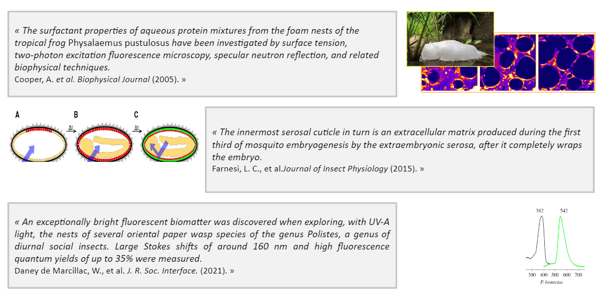
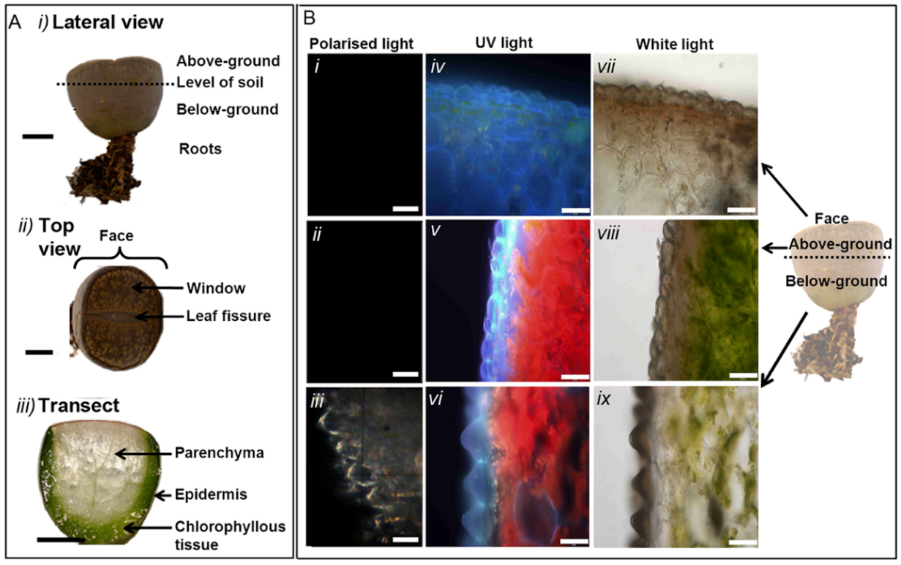

## La démarche biomimétique

En biomimétisme, on cherche à s'inspirer du Vivant pour résoudre un problème posé. Par exemple, pour aborder une problématique d'éclairage passif dans un bâtiment, on peut s'intéresser aux stratégies des plantes-cailloux, les Lithops, une plante du désert qui filtre les rayons du soleil arrivant sur ses feuilles, via des petites “fenêtres” végétales. 

<figcaption align = "center"><i>Lithops lesliei, la plante-caillou, GBIF</i></figcaption>
 

La nature est ainsi une source infinie d'innovations :

<figcaption align = "center"><i>Un milliard d'années d'innovation</i></figcaption>
 

Comprendre les stratégies d'une espèce, d'une cellule, d'un groupe d'individus, cela demande de consulter la *littérature scientifique*. De lire un article venant de Science, de Nature, et d'en comprendre le contenu, **en particulier le contenu graphique**. 
Durant la saison 10 Data For Good, nous avons voulu **faciliter l'accès et la compréhension des figures scientifiques pour un utilisateur qui voudrait pratiquer le biomimétisme sur sa thématique.**

## Le projet

:::info Explorateur de figures scientifiques pour le biomimétisme

Faciliter l'exploration de la littérature scientifique et l'extraction automatiques de données, afin d'identifier des modèles biologiques pertinents pour répondre à une problématique technique grâce au biomimétisme, l'innovation frugale inspirée du vivant.

:::

La littérature scientifique est pleine de jargons, la rendant difficile d'accès. Mais cela devient beaucoup plus explicite une fois que l'on récupère les images. 

On peut regarder cet exemple d'illustration : 

<figcaption align = "center"><i>https://journals.plos.org/plosone/article?id=10.1371/journal.pone.0075671</i></figcaption>
 

Pour y parvenir, l'équipe s'est d'abord consacrée au sourcing de la donnée, en récupérant un pool d'articles scientifiques issus de journaux open source comme [Public Library of Science](https://plos.org/) . Ces articles sont lus et  leurs textes et leurs images isolés dans une base de données structurée. Lors d'une requête utilisateur, l'outil retourne une ou plusieurs figures issues d'un article sémantiquement proche des mots clés utilisés. 

<figcaption align = "center"><i>Démonstrateur développé à la saison 10</i></figcaption>
 

## Développement des algorithmes

Quelle stratégie tech ? 

- On commence par scrapper des repository d'articles en open access, dont on parse les textes, les figures, et les liens entre ces textes et ces figures.
- Puis, une petite couche de post-processing, dans laquelle on vient : 
- D'une part classifier/labelliser les images pour en connaître la nature (dessin, photographie, courbe…)
- D'autre part créer des représentations en embedding des textes les uns par rapports aux autres
- Sur ces deux éléments, placés dans un GCP, on organise un [module de retrieval avec Haystack](https://github.com/deepset-ai/haystack), et venir chercher les textes les plus pertinents par rapport à une requête utilisateurs et récupérer ainsi toutes les images associées à ces textes. 

## Développement de l'outil
Le défi sur le plan Front : faciliter la compréhension de cette figure au lecteur, et lui faire comprendre en quoi elle est pertinente dans sa recherche. Pour cela, les modèles de text-summarization adaptés à des corpus scientifiques fournissent à l'utilisateur un texte court et abordable décrivant l'article d'origine. Une classification d'image permet de choisir le type de figure auquel on souhaite se confronter, selon que l'on veuille étudier une simple photographie, ou au contraire rentrer dans la caractérisation quantitative d'un mécanisme biologique.

## Prochaines étapes
Sur le long terme, l'outil Gawdi Generator of Biomimetic Answers With Described  Images, a vocation à faciliter l'accès du grand public à la donnée scientifique, en rendant accessible et compréhensible les éléments les plus techniques d'un article scientifique. 
Deux pistes de développement sont à envisager : 
1. permettre à l'utilisateur d'uploader directement un article qu'il possède, en format PDF, et qu'il sait être pertinent dans sa démarche, puis lui fournir de l'aide pour la lecture/compréhension ; 
2. améliorer la qualité de cette aide à la compréhension, en liant le texte à d'autres bases de données, par exemple pour mieux appréhender certaines terminologies scientifiques, mieux situer les espèces considérées dans la taxonomie du Vivant, ou bien visualiser plus facilement les mécanismes physiques mis en jeu. 

## Références
- Parce que c'est un projet Data For Good, Gawdi est bien sûr open source, ici le GitHub : https://github.com/ceebios/d4g-season-10/
- Une démonstration mi-saison : https://www.youtube.com/watch?v=9Wx7h2WptGQ&t=3650s
- Et la démo finale : https://www.youtube.com/watch?v=32lrQg8bZZM&t=3310s
- Toutes les informations sur les [collaborations entre Data For Good et Ceebios](/projects/ceebios)

##### A propos de Ceebios
Ceebios accélère la transition sociétale par le biomimétisme en fédérant un réseau d’acteurs experts et en développant les ressources indispensables à l’appropriation de la démarche par les secteurs académiques, institutionnels et privés.
Plus d'informations sur le site internet de Ceebios https://ceebios.com/

## Auteurs
*Anastasia Barkova, Evan Dufraisse, Gabriel Olympie, Karine Petrus, Lucas Le Corvec, Paul-Henri Castets, Romain Meuter, Sara Valencia, Thanh Lan, Nikolay Tchakarov (Ceebios), Adrien Saint-Sardos (Ceebios)*.

