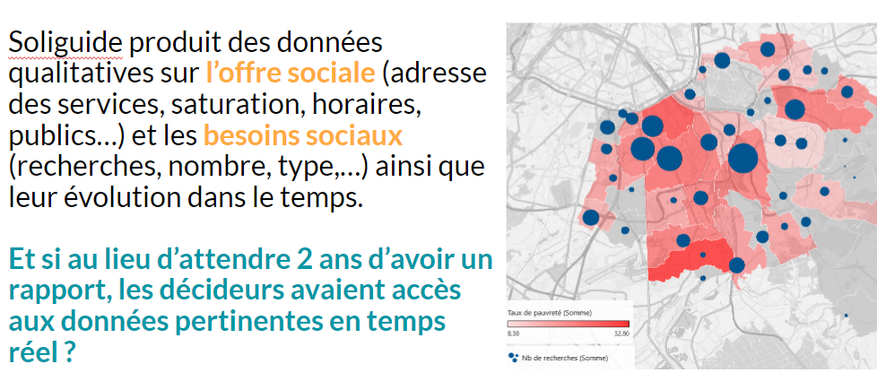

# Solinum

:::tip Diagnostiquer l'aide alimentaire

Proposer des dashboards de données analytiques pour les associations et les pouvoirs publics, permettant d'observer en un clin d'eil les besoins des territoires sur l'aide alimentaire

:::

## A propos de Solinum

[Solinum](https://www.solinum.org/) (et le Soliguide) est une association qui lutte contre la pauvreté en permettant aux personnes en situation de précarité qui d’obtenir des informations pour s’orienter et donc d’accéder à des lieux et services utiles. Aujourd'hui le Soliguide référence des lieux d'accueil, santé, alimentation, hygiène, emploi, matériel, et autres activités gratuites. **Et si au lieu d’attendre 2 ans d’avoir un rapport, les décideurs avaient accès aux données pertinentes en temps réel** ?

## Le projet : diagnostiquer l'aide alimentaire
- **L’objectif : proposer des dashboards de données analytiques pour les associations et les pouvoirs publics, permettant d'observer en un clin d’oeil les besoins des territoires sur l’aide alimentaire**.

- Exemple : Analyse de l’adéquation besoin/offre ; fermeture des structures en août ; carte isochrone d’accessibilité ; comparaison entre les territoires ; etc.
- Les données : 
    - Structures référencées sur Soliguide : 40 000 services dont 3163 services d'aide alimentaire (742 distribution de repas, 451 restauration assise, 1520 colis alimentaires, 450 épiceries sociales et solidaires)
    - Recherches faites sur Soliguide
    - Données ouvertes (taux de pauvreté INSEE ; nb de bénéficiaires du RSA ; …)

- La démarche proposée :
    - Comprendre le besoin auprès des acteurs de terrain et publics en interrogeant nos équipes ;
    - Mettre en oeuvre les flux de données nécessaires pour avoir des données en temps réel facilement manipulable ;
    - Produire des dashboard de données filtrables, réutilisables et maintenables

- La stack :
    - Site Soliguide : Angular / NodeJS
    - MongoDB (NoSQL)
    - Metabase

## Compétences recherchées
- **Data Analystes** de tous niveaux avec une appétence pour la visualisation et les projections géospatiales !
- **Data Scientists et Data Engineers** pour aller chercher des données supplémentaires et automatiser les traitements et les visualisations  

## Pour en savoir plus sur le projet
- La [vidéo de présentation](https://www.youtube.com/watch?v=bnAXCjD2l80&t=869s) au lancement de la saison 10
- La [présentation de Solinum](https://www.youtube.com/watch?v=Lgnypz2N-Fc&t=2490s) au Monthly Marty n°5
- Le site internet de Solinum https://www.solinum.org/
- Le site internet du Soliguide https://soliguide.fr/

## Rejoindre le projet
Il suffit de [rejoindre la communauté Data For Good](/join) et de se présenter sur le canal Slack **#10_solinum**

