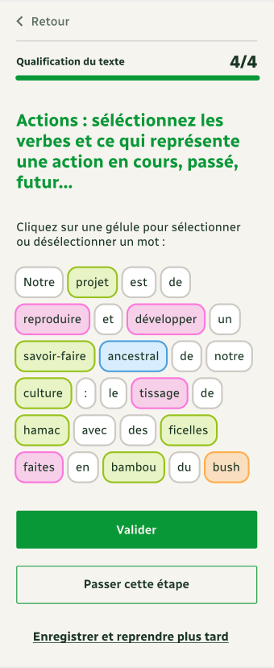
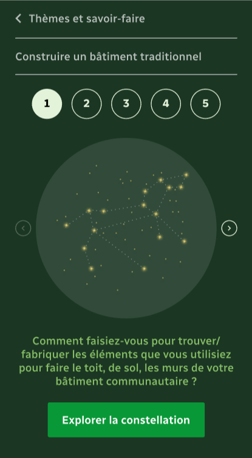

# Constellation sociale

:::tip
Ensemble, faisons que la diversité soit une force !
:::

## L'association

Constellation Sociale est une association humanitaire qui soutient les communautés rurales isolées. En les mettant en lien, elle les aide à préserver leur patrimoine culturel et naturel. Le partage de ces savoir-faire à l’international aide aussi à propager des modèles plus résilients et en lien avec l’environnement.

En participant à ce projet de partage des savoir-faire, ces communautés rurales isolées reçoivent un budget mensuel avec lequel elles peuvent lancer des projets générateurs de revenus. Les projets générateurs de revenus permettent aux communautés de s’investir et d’être accompagnées dans le développement de : leur autosuffisance alimentaire et énergétique, la préservation du patrimoine culturel et naturel, la santé et l’éducation.

## Le projet de la saison 11

Avancer dans l'exploitation du corpus et jusqu’à la représentation des savoir-faire sous forme de constellations

## Compétences recherchées

- **Corpus NLP challenges**: Exploration de corpus, Analyse sémantique, Data exploration, Data Visualization, Algorithmes NLP
- **Devops + ci/cd Android**: Java/Kotlin, déploiement continu, playstore/gestion des secrets
- **Sciences HUmaines et Sociales**: linguistique, sociologie, ethnologie, agriculute, environnement

## Références

- Le [pitch de lancement de la saison 11](https://docs.google.com/presentation/d/1QS4ju8od8lMZQdhibh7WeciZtIjGRt-RYn7LCE6eSEc/edit#slide=id.g22389111da9_4_0)
- La [chaîne Youtube](https://www.youtube.com/channel/UCdxsmas5t-yQFbaM3g73bbg) de l'association

## Equipe

- Irénée Deckers

## Rejoindre le projet

Il suffit de [rejoindre la communauté Data For Good](/join) et de se présenter sur le canal Slack #11_constellation_sociale
