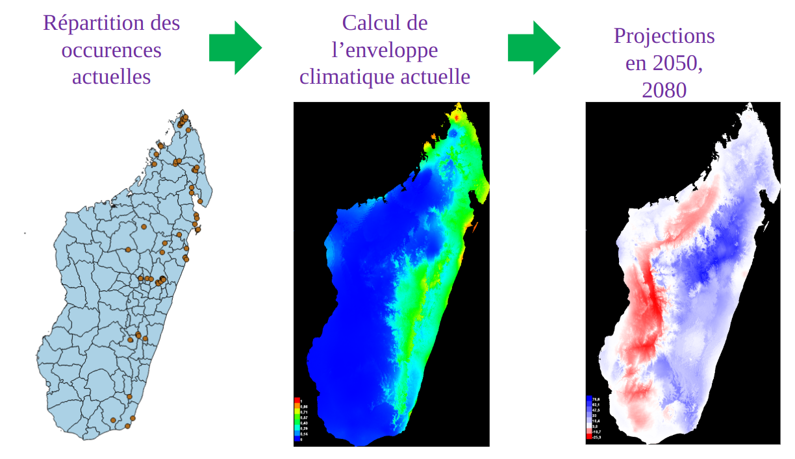

# datak

:::tip
Analyse des données biodiversité d'une famille du vivant (les fulgores) pour comprendre leurs spécificités, leurs habitats et leurs interactions
:::

DAta for a good TAxonomic biodiversity Knowledge (DATAK)

## Le projet de la saison 11

Plusieurs objectifs:

- Mieux comprendre le taxon
- Traquer les irrégularités pour alerter/suggérer
  des pistes de recherches en language naturel
- Renseigner sur le degré de vulnérabilité du taxon
  à des fins de conservation

## Compétences recherchées

- Scrapping spécialité image
- Data science deep learning classification image
- Data Ingénierie pour la gestion des données et entraînement du modèle dans le cloud
- Design

## Références

- Le [pitch de lancement de la saison 11](https://docs.google.com/presentation/d/1QS4ju8od8lMZQdhibh7WeciZtIjGRt-RYn7LCE6eSEc/edit#slide=id.g226281c13b5_15_39)

## Equipe

- Thierry Bourgoin, Institut Systématique Evolution Biodiversité, Museum

## Rejoindre le projet

Il suffit de [rejoindre la communauté Data For Good](/join) et de se présenter sur le canal Slack #11_datak
