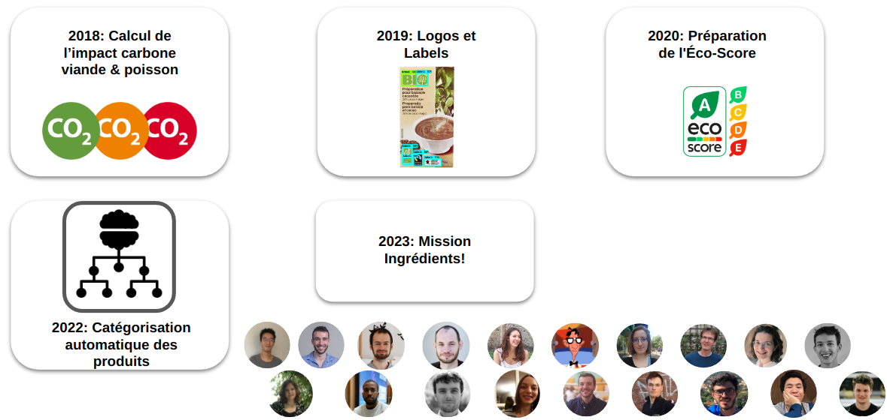

# Open Food Facts

:::tip Faire les bons choix pour sa santé et pour la planète

Réduire le temps nécessaire pour saisir des listes d’ingrédients

:::

## A propos d'Open Food Facts

S’organiser pour peser sur notre santé, sur l’environnement, sur le système alimentaire.

Open Food Facts est un projet collaboratif dont le but est de constituer une base de données libre et ouverte sur les produits alimentaires commercialisés dans le monde entier. Open Food Facts est disponible via un site web ou des applications pour mobiles. Open Food Facts a notamment produit le Nutri-Score et l'Eco-Score pour démocratiser les ACVs environnementales des produits alimentaires.

Open Food Facts en quelques chiffres :

- 2,7 millions de produits contribués par les volontaires & producteurs
- 182 pays où des contributeurs ont déjà ajouté les produits
- 2,5 M de personnes utilisent nos apps ou le site chaque mois
- 200 applis et services exploitant Open Food Facts
- 57 articles scientifiques basés sur ou citant Open Food Facts
- 25 000 contributeurs actifs qui assurent la qualité de la base

## Le projet de la saison 11

Pour la 5e saison avec Data4Good, le but est d'**extraire les ingrédients pour faciliter l'étiquetage** environnementale de notre alimentation afin de donner aux consommateurs, 
aux producteurs, aux chercheurs, aux journalistes, aux enseignants, etc. les moyens de mesurer 
et de modifier à grande échelle 
l'impact de l'alimentation sur notre santé et sur la planète.

## Les projets des saisons précédentes

## Compétences recherchées

- Machine Learning, NLP et Computer Vision
  pour extraire les données des photos
- Traitement du langage et data mining
  pour comprendre ces données
- Design et développement mobile et Web
  pour intégrer les résultats dans Hunger Games, l’app et le site Open Food Facts
- Traducteurs, annotateurs pour étendre les résultats au monde entier !

## Références

- Le [pitch de lancement de la saison 11](https://docs.google.com/presentation/d/1QS4ju8od8lMZQdhibh7WeciZtIjGRt-RYn7LCE6eSEc/edit#slide=id.g226422341dc_12_146)
- La page [Wikipedia d'Open Food Facts](https://fr.wikipedia.org/wiki/Open_Food_Facts)

## Equipe

- pierre@openfoodfacts.org
- alex@openfoodfacts.org
- Twitter: @OpenFoodFactsFR
- Slack: https://slack.openfoodfacts.org

## Rejoindre le projet

Il suffit de [rejoindre la communauté Data For Good](/join) et de se présenter sur le canal Slack #11_open_food_facts
