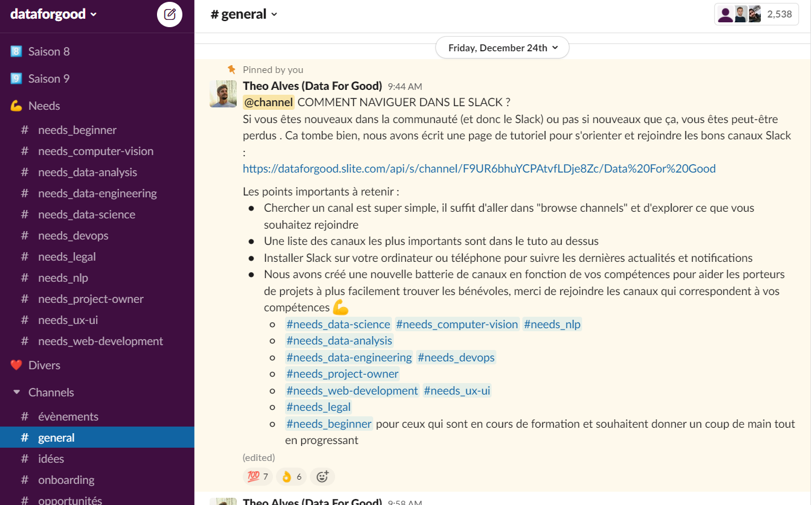

# Rejoindre la communauté Data For Good

:::info Data For Good

La communauté Data for Good compte plus de 4000 volontaires qui consacrent plusieurs heures par semaine au service de projets d'intérêt général.

Vous êtes Data Scientists/Analyst/Engineers, Developers, UX/UI designer, ou Project Manager ? [Rejoignez-nous](https://ffb35838.sibforms.com/serve/MUIEAOPtEpVbDgcqr78ZqBZ4e29fMDkyLfy8STH6MkmxU5ePAP5_NQQeWEI0nR8fdBds27Va8cMSjjzNni1iqd_mpJsZS8uQUA95o0Tg3njStpz8nDV59tRiQJ_ZWBat1uyRjTYtyVHMpV3I--z4g14Ggsji0895jBcQr70arsW82eFJGwC8fgxYOvnPL-rFQcNwmjkA5JTbjcvd) !

:::

:::tip Rejoindre la communauté Data For Good

Pour rejoindre la communauté, il vous suffit de remplir ce [questionnaire](https://ffb35838.sibforms.com/serve/MUIEAOPtEpVbDgcqr78ZqBZ4e29fMDkyLfy8STH6MkmxU5ePAP5_NQQeWEI0nR8fdBds27Va8cMSjjzNni1iqd_mpJsZS8uQUA95o0Tg3njStpz8nDV59tRiQJ_ZWBat1uyRjTYtyVHMpV3I--z4g14Ggsji0895jBcQr70arsW82eFJGwC8fgxYOvnPL-rFQcNwmjkA5JTbjcvd) ! 
Il vous sera donné un accès au [Slack](#le-slack-data-for-good) qui est le coeur de la communauté.

:::

<a href="https://ffb35838.sibforms.com/serve/MUIEAOPtEpVbDgcqr78ZqBZ4e29fMDkyLfy8STH6MkmxU5ePAP5_NQQeWEI0nR8fdBds27Va8cMSjjzNni1iqd_mpJsZS8uQUA95o0Tg3njStpz8nDV59tRiQJ_ZWBat1uyRjTYtyVHMpV3I--z4g14Ggsji0895jBcQr70arsW82eFJGwC8fgxYOvnPL-rFQcNwmjkA5JTbjcvd" target="_blank" className="button button--secondary button--lg button-home">
Rejoindre la communauté - 5min ⏱
</a>

## Etre un bénévole Data For Good
Participer à la communauté Data For Good, c'est donner plusieurs heures de ton temps personnel pour accélérer des associations et des ONGs sur leurs problématiques d'intérêt général. Mais en pratique être bénévole cela veut dire : 
- Faire partie d'une communauté tech engagée
- Participer aux saisons d'accélération
- Participer aux projets hors-saison
- Proposer des idées d'intérêt général pour fédérer un groupe de volontaire
- Répondre à des demandes ponctuelles d'aides des associations
- Ecrire ou partager des articles
- Contribuer à du développement open-source
- Prendre parole pour critiquer constructivement sur les dérives et les risques de la technologie
- Mettre en relation Data For Good avec d'autres associations qui pourraient avoir besoin d'aide
- Découvrir les précédents projets Data For Good ou revisionner nos derniers évènements
- Former d'autres membres de la communauté ou demander de l'aide sur un sujet d'intérêt général
- Proposer à d'autres personnes de rejoindre la communauté
- Proposer des partenariats
- ... Bref, Data For Good est une communauté libre et indépendante, tu peux proposer ce que tu veux !

## Le Slack Data For Good
Slack est un outil de messagerie communautaire, c'est aujourd'hui le coeur de la communauté où se passe les discussions entre volontaires, l'organisation autour des projets, et où se partagent évènements, offres d'emploi, liens et actualités de l'association. Pour rejoindre le Slack, c'est simple il suffit de remplir le questionnaire ci-dessus. 

 

