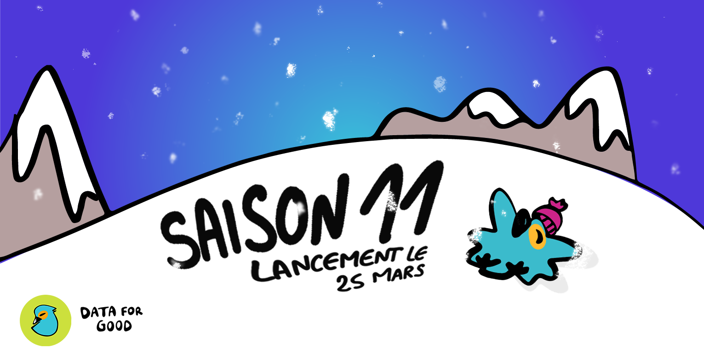

# Saison 11

:::info La saison 11 de Data For Good
Après 10 saisons et 100 projets depuis 2014, l'équipe Data For Good est ravie de vous annoncer le lancement de la saison 11, qui revient le **25 mars 2023** pour 3 mois. Notre mission : aider les acteurs de l’intérêt général à faire usage de leurs données pour augmenter leur impact sur le terrain. 3 mois pour s'engager en tant que volontaire et mettre ses compétences tech au service de l'impact social et environnemental. 3 mois pour proposer un projet, une idée, une solution pour les associations, ONGs, ou organismes de service public. 
:::: 

## Pour assister au lancement

<section>
    

    <h2>Lancement de la saison 11 de Data For Good le samedi 25 mars à 14h</h2>
    
Inscriptions sur <a href="https://app.livestorm.co/data-for-good/saison11?type=detailed" target="_blank">Livestorm</a> ou juste ici 👇

    <iframe width="100%" height="480" frameborder="0" src="https://app.livestorm.co/p/cb35fa4d-8db9-40f5-a558-baf41586a818/form" title="Lancement saison 11 Data For Good | Data For Good"></iframe>
    
  
</section>

<!-- ## Vous souhaitez proposer un projet ?
- Vous êtes une association, une ONG, une administration de service public, une entreprise de l'ESS ? Ou bien simplement un.e citoyen.ne ayant une idée géniale ?
- Vous avez une mission d’intérêt général ?
- Vous avez un projet ou une idée à impact social ou environnemental qui pourrait bénéficier d'un accompagnement par nos 4000 bénévoles tech (Data, Produit, Dev) pendant 3 mois ?
- Vous êtes dans une démarche et philosophie open source ?  

<a href="https://airtable.com/shrHeRpQl3O0GMhcw" target="_blank" className="button button--secondary button--lg button-home">
Proposer un projet - 10min ⏱
</a>

Pour plus de détails, ou pour partager l'appel à projet, vous pouvez utiliser cette [page Notion](https://dataforgood.notion.site/Lancement-de-l-appel-projet-pour-la-saison-11-de-Data-For-Good-acb86451180a4f46a6fbc153412e82d7) -->

## Vous souhaitez participer à la saison 11 en tant que bénévole ?
Vous êtes Data Scientist, Data Analyst, Data Engineer, Développeur Web, Project ou Product Manager, UX/UI Designer, ou vous avez simplement envie de vous engager sur un projet à fort impact social et environnemental. Vous pouvez dès maintenant rejoindre la communauté de bénévoles sur [https://dataforgood.fr/join](https://dataforgood.fr/join) ou cliquer sur le lien ci-dessous. 

<a href="https://ffb35838.sibforms.com/serve/MUIEAOPtEpVbDgcqr78ZqBZ4e29fMDkyLfy8STH6MkmxU5ePAP5_NQQeWEI0nR8fdBds27Va8cMSjjzNni1iqd_mpJsZS8uQUA95o0Tg3njStpz8nDV59tRiQJ_ZWBat1uyRjTYtyVHMpV3I--z4g14Ggsji0895jBcQr70arsW82eFJGwC8fgxYOvnPL-rFQcNwmjkA5JTbjcvd" target="_blank" className="button button--secondary button--lg button-home">
Rejoindre la communauté - 5min ⏱
</a>

