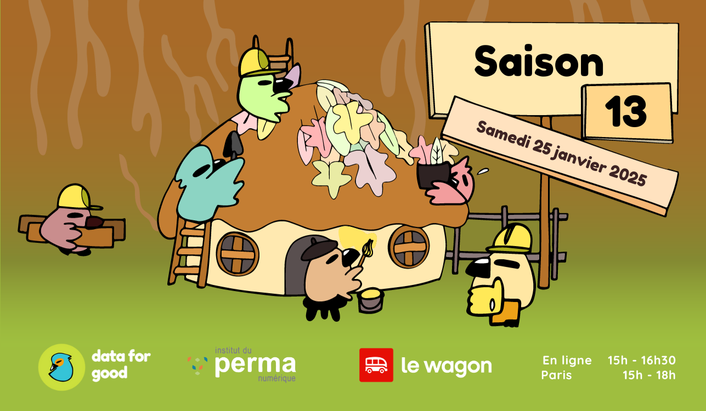

# Saison 12

:::info La saison 13 de Data For Good
Pendant 3 mois à partir du 25 janvier jusqu'à début mai, devenez bénévoles sur des projets à impact positifs sociaux et environnementaux. Vous êtes artisans de la donnée, experts de l'analyse, geek des algorithmes, chef.fe de projet, designer ou développeur.eus.e ?

Une dizaine d'associations et ONGs ont proposé des projets numériques sur lesquels ils ont besoin d'un coup de main. Des équipes citoyennes se formeront ensuite pour travailler ensemble pendant 3 mois et résoudre à leur échelle un grand défi social ou environnemental : lutte contre la pêche frauduleuse, évasion fiscale, transition énergétique, ...

Vous voulez rejoindre l'aventure et faire partie des 5000 bénévoles qui se sont engagés auprès d'Action Contre la Faim, 2Tonnes, Surfrider, Shift Project, QuotaClimat, Open Food Facts ?
::::

## Revoir le live du lancement

<section style={{"margin-bottom":"20px"}}>
    

    <iframe width="800" height="500" src="https://www.youtube.com/embed/pwBhVAz8_uY?si=V8XrHqlnxeT76GYP"  title="YouTube video player" frameBorder="0" allow="accelerometer; autoplay; clipboard-write; encrypted-media; gyroscope; picture-in-picture; web-share" allowFullScreen></iframe>
    
  
</section>

## Vous souhaitez participer à la saison 12 en tant que bénévole ?

Vous êtes Data Scientist, Data Analyst, Data Engineer, Développeur Web, Project ou Product Manager, UX/UI Designer, ou vous avez simplement envie de vous engager sur un projet à fort impact social et environnemental. Vous pouvez dès maintenant rejoindre la communauté de bénévoles sur [https://dataforgood.fr/join](https://dataforgood.fr/join) ou cliquer sur le lien ci-dessous.

<a href="https://ffb35838.sibforms.com/serve/MUIEAOPtEpVbDgcqr78ZqBZ4e29fMDkyLfy8STH6MkmxU5ePAP5_NQQeWEI0nR8fdBds27Va8cMSjjzNni1iqd_mpJsZS8uQUA95o0Tg3njStpz8nDV59tRiQJ_ZWBat1uyRjTYtyVHMpV3I--z4g14Ggsji0895jBcQr70arsW82eFJGwC8fgxYOvnPL-rFQcNwmjkA5JTbjcvd" target="_blank" className="button button--secondary button--lg button-home">
Rejoindre la communauté - 5min ⏱
</a>

## Les 10 projets de la saison 12

### [🛥️ Projet 1 : Rendre visible la pollution de l'ean - Générations futures](/projects/pollutioneau)

Les polluants chimiques sont omniprésents mais invisibles. Il faut rendre transparentes, accessibles et compréhensibles les données relatives à la pollution chimique de l'eau. Le projet vise à agréger les données des analyses disponibles pour faire une carte compréhensible pour le grand public.

👉 Si vous voulez contribuer à ce projet, rejoignez le canal [#13_pollution_eau](https://data-for-good.slack.com/archives/C089BKT6C6T) !

### [🐟 Projet 2 : 505 - Watizat](/projects/watizat)

Parce que l’accès à l’information est un premier pas vers l’accès aux droits et aux biens et services de premières nécessité, L’association Watizat veut garantir l’accès à l’information des personnes exilées en France. Pour cela, le projet créera un chatbot graphique (utilisant des émoticones) d’orientation pour les personnes en grande précarité, utilisable sur Whatsapp.

👉 Si vous voulez contribuer à ce projet, rejoignez le canal [#13_505](https://data-for-good.slack.com/archives/C089UMMKMC4)

### [🩴 Projet 3 : STOP Cyberviolences - Centres RELIER](/projects/stopcyberviolence/)

Il est nécessaire de réduire l'impact des cyberviolences sur les jeunes car elles ont un effet nefaste sur la santé mentale d’un grand nombre d’entre eux. Le projet vise à construire un modèle de données qui permettra de constituer un baromètre des cyberviolences.

👉 Si vous voulez contribuer à ce projet, rejoignez le canal [#13_stop_cyberviolence](https://data-for-good.slack.com/archives/C089PBBN2KF) !

### [💸 Projet 4 : Collectif 50/50](/projects/collectif5050)

Le Collectif 50/50 veut sensibiliser, conscientiser, inclure, prévenir et agir sur les biais de représentation dans le domaine de la culture. Le projet s’attachera à outiller l’association pour pouvoir analyser à grande échelle des données cinématographique et ainsi faciliter les analyses futures.

👉 Si vous voulez contribuer à ce projet, rejoignez le canal [#13_reveler_inegalites_cinema](https://data-for-good.slack.com/archives/C089S3UCMCK)

### [🧑‍⚕️ Projet 5 : OD&IS - J'accueille](/projects/odis)

L’approche OD&IS aide à favoriser l’accueil et la mobilité des personnes exilées en zone périurbaine et rurale, grâce à un outil statistique de diagnostic territorial et la mise en contact avec des hôtes citoyens. La collaboration avec Data for Good veut aller plus loin en permettant d’automatiser la mise à jour de leurs jeux de données. Le projet mêle automatisation, analyse et construction d’un produit avec chatbot pour faciliter les interactions.  

👉 Si vous voulez contribuer à ce projet, rejoignez Boris et Nassima dans le canal [#13_odis](https://data-for-good.slack.com/archives/C08AF157HK2)

### [⛺ Projet 6 : Potentiel S(c)olaire) - Greenpeace](/projects/potentiels(c)olaire)

Dans le cadre d'une campagne plus large sur les établissements scolaires français, Greenpeace souhaiterait trouver des chiffres fiables et clairs sur le potentiel photovoltaïque des bâtiments publics afin d'inciter les chefs d'établissements ou politiques à prendre des mesures. Le but est de construire une base de données contenant chaque école et son potentiel solaire, puis de l’exploiter dans un produit sous forme de carte.

👉 Si vous voulez contribuer à ce projet, rejoignez Victor et Ludivine dans le canal [#13_potentiel_solaire](https://data-for-good.slack.com/archives/C08AF0NF68Y)

### [👗 Projet 7 : L’Empreinte Souffrance : Welfare Footprint Project](/projects/empreintesouffrance)

Nous faisons face à un important déficit de transparence alimentaire sur le sujet de la souffrance animale. Les données ont été récoltée, il s’agit de les organiser et les diffuser avec un site de référence sur l'empreinte souffrance des produits d’origine animale, pour alimenter l’état de l’art et alerter les citoyens.

👉 Si vous voulez contribuer à ce projet, rejoignez Maurane, Catherine, William et Alizée dans le canal [#13_empreinte_souffrance](https://data-for-good.slack.com/archives/C089BLSAVT9)

### [🎥 Projet 8 : Démocratiser la sobriété - World Sufficency Lab](/projects/democratisersobriete)

La sobriété est sur toutes les lèvres en France. A travers le laboratoire des sobriétés, on souhaite montrer que la sobriété n’est pas punitive et qu'au contraire, elle est avant tout un outil de justice sociale indispensable pour la transition écologique. Ce projets vise à construire : un outil de recherche dans la littérature scientifique, un outil de formation et une plateforme communautaire.

👉 Si vous voulez contribuer à ce projet, rejoignez Eléonore G., Eléonore M. et Charles dans [#13_democratiser_sobriete](https://data-for-good.slack.com/archives/C089S5Q1342)

### [🤖 Projet 9 : Une IA pour les AAP - Data for Good & SOS](/projects/iaforgood)

Les associations cherchent au quotidien des financements pour soutenir et développer leurs projets. Les appels à projets publics et privés sont une source clé de financement pour les associations. Le processus est chronophage et implique des équipes entières, une veille constante, des délais courts et des résultats incertains. Un outil pour faciliter la réponse aux appels à projets serait un gain de temps considérable pour les acteurs associatifs. 

👉 Si vous voulez contribuer à ce projet, rejoignez Samuel et Caroline sur [#13_ia_financement](https://data-for-good.slack.com/archives/C08AF0NF68Y)

### [🔥 Projet 10 : ECOSKILLS - Une Fonction Publique pour la Transition Ecologique](/projects/ecoskills)

L’association « Une Fonction publique pour la transition écologique » réunit des agents publics déterminés à intégrer la transition écologique dans les décisions et projets de l’administration. Elle nous proposer de créer agent conversationnel qui puisse s'adapter aux besoins variés des agents publics et proposer des recommandations pour adapter leur quotidien aux défis écologiques. 

👉 Si vous voulez contribuer à ce projet, rejoignez Mateo et Thomas dans le canal [#13_ecoskills](https://data-for-good.slack.com/archives/C089UMJBKB6)

### [🔥 Projet 11 : Eclaireur Public - Transparency International France & Anticor](/projects/eclaireurpublic)

Depuis une dizaine d'année, la France a fait d'important progrès en matière de transparence de la vie publique, et de nombreux jeux de données ont été ouverts. Néanmoins une majorité des collectivités ne les publie toujours pas et ils peuvent être difficiles d'accès. Ce projet vise à créer un outil de recherche unique pour faciliter l'accès aux différents jeux de données ouverts disponibles en France pour détecter la corruption, et y détecter l'occurrence d'une personne morale ou physique, et d'éventuelles connexions. De plus, l’outil pourra permettre aux citoyens d’identifier les contacts en cas de manque de données disponibles dans sa commune.

👉 Si vous voulez contribuer à ce projet, rejoignez Mateo et Thomas dans le canal [#13_eclaireur_public](https://data-for-good.slack.com/archives/C089S6LBE1G)

### [🔥 Projet 12 : Brigade de surveillance des coupes rases - Canopée Forêts Vivantes)](/projects/brigadecoupesrases)

En forêt française, la pratique des coupes rases, qui consiste à couper en une fois l’intégralité des arbres d’une parcelle, est fortement controversée - mais les données de suivi de ces coupes ne sont pas publiques et les coupes abusives sont rarement sanctionnées. Le but du projet est de surveiller les coupes rase et d’être capable de détecter automatiquement les coupes abusives en temps réel à partir des données satellite disponibles.

👉 Si vous voulez contribuer à ce projet, rejoignez Mateo et Thomas dans le canal [#13_brigade_coupes_rases](https://data-for-good.slack.com/archives/C089S6LBE1G)
